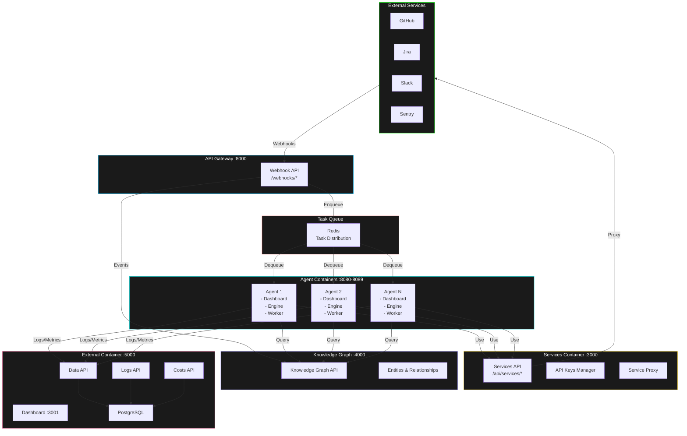

# Architecture Visual Summary

## System Overview



## Container Details

### 1. Agent Container (Scalable)

```
┌─────────────────────────────────────────┐
│         Agent Container :8080           │
├─────────────────────────────────────────┤
│  Internal Dashboard                     │
│  ├─ Agents Management                   │
│  ├─ Skills Management                   │
│  ├─ Rules Management                    │
│  ├─ Chat Interface                      │
│  └─ Real-time Task Logs                 │
├─────────────────────────────────────────┤
│  Agent Engine                           │
│  ├─ Task Worker                         │
│  ├─ CLI Executor (Claude)               │
│  └─ Queue Manager                       │
├─────────────────────────────────────────┤
│  Configuration (.claude/)               │
│  ├─ rules/                              │
│  ├─ skills/                             │
│  │   ├─ github-operations/              │
│  │   ├─ jira-operations/                │
│  │   ├─ slack-operations/               │
│  │   ├─ webhook-management/             │
│  │   ├─ testing/                        │
│  │   └─ verification/                   │
│  ├─ agents/                             │
│  │   ├─ planning/                       │
│  │   ├─ executor/                       │
│  │   ├─ verifier/                       │
│  │   ├─ github-issue-handler/           │
│  │   ├─ github-pr-review/               │
│  │   └─ jira-code-plan/                 │
│  ├─ commands/                           │
│  └─ hooks/                              │
├─────────────────────────────────────────┤
│  Storage                                │
│  ├─ tmp/ (Repositories)                 │
│  └─ logs/ (Local Logs)                  │
└─────────────────────────────────────────┘
```

### 2. External Container (Singleton)

```
┌─────────────────────────────────────────┐
│      External Container :5000           │
├─────────────────────────────────────────┤
│  Dashboard :3001                        │
│  ├─ Statistics (Costs, Tasks)           │
│  ├─ Logs Viewer (Historical + Live)     │
│  ├─ Webhook Management                  │
│  ├─ Commands Management                 │
│  └─ Triggers Management                 │
├─────────────────────────────────────────┤
│  APIs                                   │
│  ├─ /api/data/*                         │
│  ├─ /api/costs                          │
│  ├─ /api/logs                           │
│  ├─ /api/chat                           │
│  └─ /api/analytics                      │
├─────────────────────────────────────────┤
│  Storage                                │
│  ├─ PostgreSQL (Centralized DB)         │
│  └─ Log Storage (Indexed)               │
└─────────────────────────────────────────┘
```

### 3. Services Container (External)

```
┌─────────────────────────────────────────┐
│      Services Container :3000           │
├─────────────────────────────────────────┤
│  Services API                           │
│  ├─ /api/services/github                │
│  ├─ /api/services/jira                  │
│  ├─ /api/services/slack                 │
│  └─ /api/services/sentry                │
├─────────────────────────────────────────┤
│  API Keys Manager                       │
│  ├─ Secure Storage                      │
│  ├─ Key Rotation                        │
│  └─ Access Logging                      │
├─────────────────────────────────────────┤
│  Service Proxy                          │
│  ├─ Unified Interface                   │
│  ├─ Request Transformation              │
│  └─ Error Handling                      │
├─────────────────────────────────────────┤
│  MCP Server (Future)                    │
│  └─ Model Context Protocol              │
└─────────────────────────────────────────┘
```

## File Structure

```
agents-system/
│
├── claude.md                    # 🌐 Global Configuration
├── docker-compose.yml           # 🐳 Container Orchestration
├── .env                         # 🔐 Environment Variables
├── Makefile                     # ⚙️ Management Commands
│
├── agent-container/             # 🤖 Agent Container
│   ├── Dockerfile
│   ├── claude.md               # Agent-specific config
│   ├── main.py
│   ├── requirements.txt
│   ├── .claude/
│   │   ├── rules/
│   │   ├── skills/
│   │   │   ├── github-operations/
│   │   │   ├── jira-operations/
│   │   │   ├── slack-operations/
│   │   │   ├── webhook-management/
│   │   │   ├── testing/
│   │   │   └── verification/
│   │   ├── agents/
│   │   │   ├── planning/
│   │   │   ├── executor/
│   │   │   ├── verifier/
│   │   │   ├── github-issue-handler/
│   │   │   ├── github-pr-review/
│   │   │   └── jira-code-plan/
│   │   ├── commands/
│   │   └── hooks/
│   ├── core/
│   │   ├── engine.py
│   │   ├── worker.py
│   │   └── cli_executor.py
│   ├── dashboard/
│   │   ├── app.py
│   │   ├── static/
│   │   └── templates/
│   └── tmp/                    # Temporary repositories
│
├── external-container/          # 📊 External Container
│   ├── Dockerfile
│   ├── claude.md               # External-specific config
│   ├── main.py
│   ├── requirements.txt
│   ├── dashboard/              # React/Vue Dashboard
│   │   ├── package.json
│   │   └── src/
│   │       ├── components/
│   │       │   ├── Statistics.tsx
│   │       │   ├── LogsViewer.tsx
│   │       │   ├── WebhookManagement.tsx
│   │       │   ├── CommandsManagement.tsx
│   │       │   └── TriggersManagement.tsx
│   │       └── App.tsx
│   ├── api/
│   │   └── routes/
│   │       ├── data.py
│   │       ├── costs.py
│   │       ├── logs.py
│   │       ├── chat.py
│   │       └── analytics.py
│   └── storage/
│       └── database.py
│
├── services-container/          # 🔌 Services Container
│   ├── Dockerfile
│   ├── claude.md
│   ├── main.py
│   ├── api/
│   │   └── routes/
│   │       ├── github.py
│   │       ├── jira.py
│   │       ├── slack.py
│   │       └── sentry.py
│   ├── mcp/                    # Future MCP support
│   │   └── server.py
│   ├── config/
│   │   └── api_keys.py
│   └── proxy/
│       └── service_proxy.py
│
├── api-gateway/                 # 🚪 API Gateway
│   ├── Dockerfile
│   ├── main.py
│   ├── routes/
│   │   └── webhooks.py
│   └── middleware/
│       ├── validator.py
│       └── router.py
│
├── knowledge-graph/             # 🧠 Knowledge Graph
│   ├── Dockerfile
│   ├── main.py
│   ├── api/
│   │   └── routes/
│   │       ├── entities.py
│   │       ├── relationships.py
│   │       └── webhooks.py
│   ├── engine/
│   │   ├── entity_manager.py
│   │   └── relationship_manager.py
│   └── storage/
│       └── graph_db.py
│
└── docs/                        # 📚 Documentation
    ├── architecture/
    ├── api/
    └── deployment/
```

## Quick Start Commands

```bash
# Initial setup
make setup

# Build all containers
make build

# Start all containers
make up

# View logs
make logs

# Scale agent containers to 5 instances
make scale-agents
# Enter: 5

# Check system health
make health

# Stop all containers
make down
```

## Port Mapping

| Service | Port | Purpose |
|---------|------|---------|
| API Gateway | 8000 | Webhook reception |
| Services Container | 3000 | Services API |
| External Dashboard | 3001 | Web UI |
| Knowledge Graph | 4000 | Graph API |
| External API | 5000 | Data/Logs/Costs API |
| Redis | 6379 | Task Queue |
| PostgreSQL | 5432 | Database |
| Agent Containers | 8080-8089 | Agent Dashboards |

## Data Flows

### Webhook Processing Flow

```
1. GitHub sends webhook
   ↓
2. API Gateway receives (/webhooks/github)
   ↓
3. Validates signature
   ↓
4. Enqueues task to Redis
   ↓
5. Forwards event to Knowledge Graph
   ↓
6. Agent pulls task from Redis
   ↓
7. Agent processes task
   ↓
8. Agent queries Knowledge Graph for context
   ↓
9. Agent uses Services Container for GitHub API
   ↓
10. Agent sends logs to External Container
   ↓
11. External Container stores in PostgreSQL
   ↓
12. Dashboard displays real-time updates
```

### Chat with Agent Flow

```
1. User opens Agent Dashboard (localhost:8080)
   ↓
2. User sends message in chat
   ↓
3. Agent Engine receives message
   ↓
4. Engine executes Claude CLI
   ↓
5. Claude processes request
   ↓
6. If needed, calls Services Container
   ↓
7. Services Container calls GitHub/Jira/Slack
   ↓
8. Response streams back to dashboard
   ↓
9. Logs sent to External Container
```

### Statistics Viewing Flow

```
1. User opens External Dashboard (localhost:3001)
   ↓
2. Dashboard queries External API
   ↓
3. External API queries PostgreSQL
   ↓
4. Returns costs, tasks, metrics
   ↓
5. Dashboard displays charts and stats
```

## Scaling Architecture

```
┌──────────────────────────────────────────────────────┐
│                   Load Balancer                      │
│              (Webhook Distribution)                  │
└──────────────────────────────────────────────────────┘
                         │
        ┌────────────────┼────────────────┐
        ▼                ▼                ▼
┌──────────────┐ ┌──────────────┐ ┌──────────────┐
│   Agent 1    │ │   Agent 2    │ │   Agent N    │
│   :8080      │ │   :8081      │ │   :808N      │
└──────────────┘ └──────────────┘ └──────────────┘
        │                │                │
        └────────────────┼────────────────┘
                         ▼
                ┌─────────────────┐
                │   Redis Queue   │
                │  (Task Bridge)  │
                └─────────────────┘
                         │
        ┌────────────────┼────────────────┐
        ▼                ▼                ▼
┌──────────────┐ ┌──────────────┐ ┌──────────────┐
│  Services    │ │  Knowledge   │ │  External    │
│  Container   │ │    Graph     │ │  Container   │
└──────────────┘ └──────────────┘ └──────────────┘
```

## Configuration Hierarchy

```
Root claude.md (Global)
    │
    ├─→ Agent claude.md (Inherits + Extends)
    │   ├─ Agent-specific rules
    │   ├─ Agent-specific skills
    │   ├─ Agent-specific commands
    │   └─ Agent-specific hooks
    │
    ├─→ External claude.md (Inherits + Extends)
    │   ├─ External-specific rules
    │   └─ External-specific config
    │
    └─→ Services claude.md (Inherits + Extends)
        ├─ Services-specific rules
        └─ Services-specific config
```

## Implementation Timeline

```
Week 1-2:   Foundation & Setup
            ├─ Root structure
            ├─ Docker compose
            └─ Task queue

Week 3-4:   Agent Container
            ├─ Core engine
            ├─ Internal dashboard
            └─ Configuration system

Week 5-6:   External Container
            ├─ Dashboard UI
            ├─ APIs
            └─ Storage layer

Week 7-8:   Services & Gateway
            ├─ Services container
            ├─ API gateway
            └─ Knowledge graph

Week 9-10:  Integration & Testing
            ├─ Inter-container communication
            ├─ Testing
            └─ Documentation

Week 11-12: Deployment & Scaling
            ├─ Production setup
            ├─ Scaling config
            └─ Monitoring
```

## Success Metrics

### Technical Metrics
- ✅ Container startup time < 30s
- ✅ Inter-container latency < 100ms
- ✅ Task processing time < 5min (avg)
- ✅ System uptime > 99.9%
- ✅ Horizontal scaling working (1-10 agents)

### Functional Metrics
- ✅ Webhook processing end-to-end working
- ✅ Chat interface responsive
- ✅ Real-time logs visible
- ✅ Statistics accurate
- ✅ All dashboards functional

### Operational Metrics
- ✅ Deployment time < 5min
- ✅ Scaling time < 2min
- ✅ Recovery time < 1min
- ✅ Documentation complete
- ✅ Monitoring in place
