# Proposed Architecture - Detailed Mermaid Diagrams

Detailed architecture diagram according to requirements from todo.txt (lines 6-38)

---

## 1. Overview

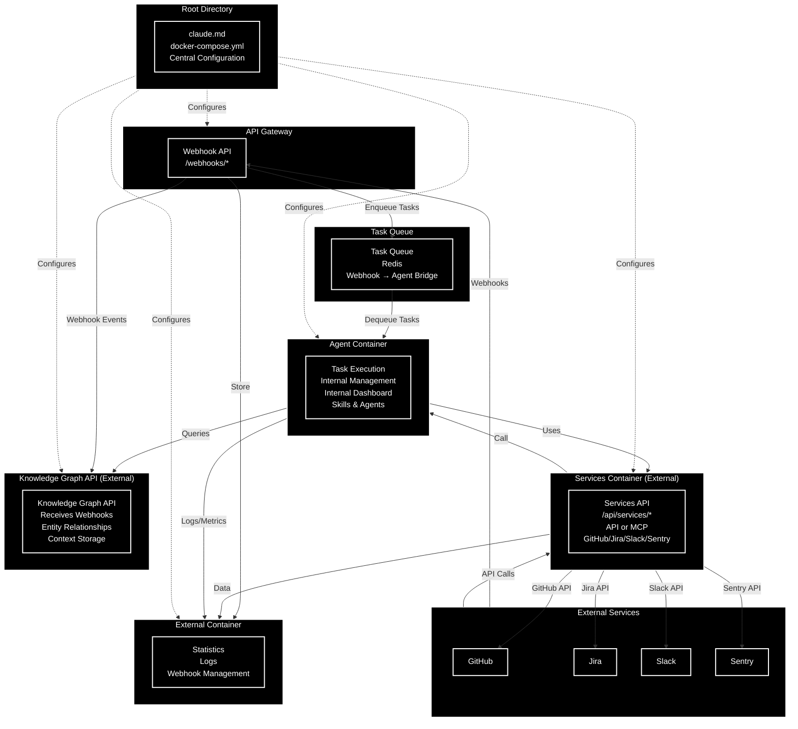

---

## 2. Agent Container (Full Details)

```mermaid
graph TB
    subgraph AgentContainer["Agent Container"]

        subgraph AgentDashboard["Internal Dashboard"]
            direction TB
            AgentMgmt["Agents Management"]
            SkillsMgmt["Skills Management"]
            RulesMgmt["Rules Management"]
            ChatUI["Chat Interface"]
            TaskLogsUI["Task Logs Viewer"]
        end

        subgraph AgentCore["Agent Core"]
            direction TB
            Engine["Agent Engine<br/>Task Execution"]
            Queue["Task Queue<br/>Redis"]
            Worker["Task Worker<br/>Task Processing"]
            CLIExec["CLI Executor<br/>Claude CLI Execution"]
        end

        subgraph AgentConfig["Configuration"]
            direction LR
            Rules["Rules<br/>.claude/rules/"]
            Skills["Skills<br/>.claude/skills/<br/>github-operations<br/>jira-operations<br/>slack-operations<br/>webhook-management<br/>testing<br/>verification"]
            Agents["Agents<br/>.claude/agents/<br/>planning<br/>executor<br/>verifier<br/>github-issue-handler<br/>github-pr-review<br/>jira-code-plan"]
            Commands["Commands<br/>.claude/commands/"]
            Hooks["Hooks<br/>.claude/hooks/"]
        end

        subgraph AgentFiles["Files"]
            direction TB
            Dockerfile["Dockerfile"]
            ClaudeMD["claude.md<br/>rules, skills, agent,<br/>commands, hooks"]
            MainPy["main.py"]
            Requirements["requirements.txt"]
        end

        subgraph AgentStorage["Local Storage"]
            direction TB
            LocalDB["Local Database"]
            LocalLogs["Local Logs"]
            TmpRepos["tmp/<br/>Relevant Repositories<br/>Cloned for Tasks"]
        end

        subgraph AgentExternalAccess["External Service Access"]
            direction TB
            MCPServer["MCP Server<br/>Model Context Protocol<br/>Service Integration"]
            ExternalService["External Service<br/>API Keys Manager<br/>GitHub/Jira/Slack APIs"]
        end
    end

    AgentDashboard -->|Manages| AgentMgmt
    AgentDashboard -->|Manages| SkillsMgmt
    AgentDashboard -->|Manages| RulesMgmt
    AgentDashboard -->|Interacts| ChatUI
    AgentDashboard -->|Views| TaskLogsUI

    Engine -->|Reads| ClaudeMD
    Engine -->|Loads| Rules
    Engine -->|Loads| Skills
    Engine -->|Loads| Agents
    Engine -->|Loads| Commands
    Engine -->|Loads| Hooks

    Engine -->|Creates Tasks| Queue
    Queue -->|Processes| Worker
    Worker -->|Executes| CLIExec
    Worker -->|Streams| TaskLogsUI
    Worker -->|Updates| LocalDB
    Worker -->|Writes| LocalLogs
    Worker -->|Clones Repos| TmpRepos

    Engine -->|Loads| Skills
    Engine -->|Loads| Agents
    Engine -->|Uses| MCPServer
    MCPServer -->|Connects| ExternalService
    Worker -->|Accesses| ExternalService
    ExternalService -->|GitHub API| GitHub
    ExternalService -->|Jira API| Jira
    ExternalService -->|Slack API| Slack

    ClaudeMD -.->|Configures| Engine
    Dockerfile -.->|Builds| AgentContainer
    MainPy -.->|Implements| Engine

    classDef defaultNode fill:#000000,stroke:#ffffff,stroke-width:2px,color:#ffffff

    class AgentContainer,AgentDashboard,AgentMgmt,SkillsMgmt,RulesMgmt,ChatUI,TaskLogsUI,AgentCore,Engine,Queue,Worker,CLIExec,AgentConfig,Rules,Skills,Agents,Commands,Hooks,AgentFiles,Dockerfile,ClaudeMD,MainPy,Requirements,AgentStorage,LocalDB,LocalLogs,TmpRepos,AgentExternalAccess,MCPServer,ExternalService defaultNode
```

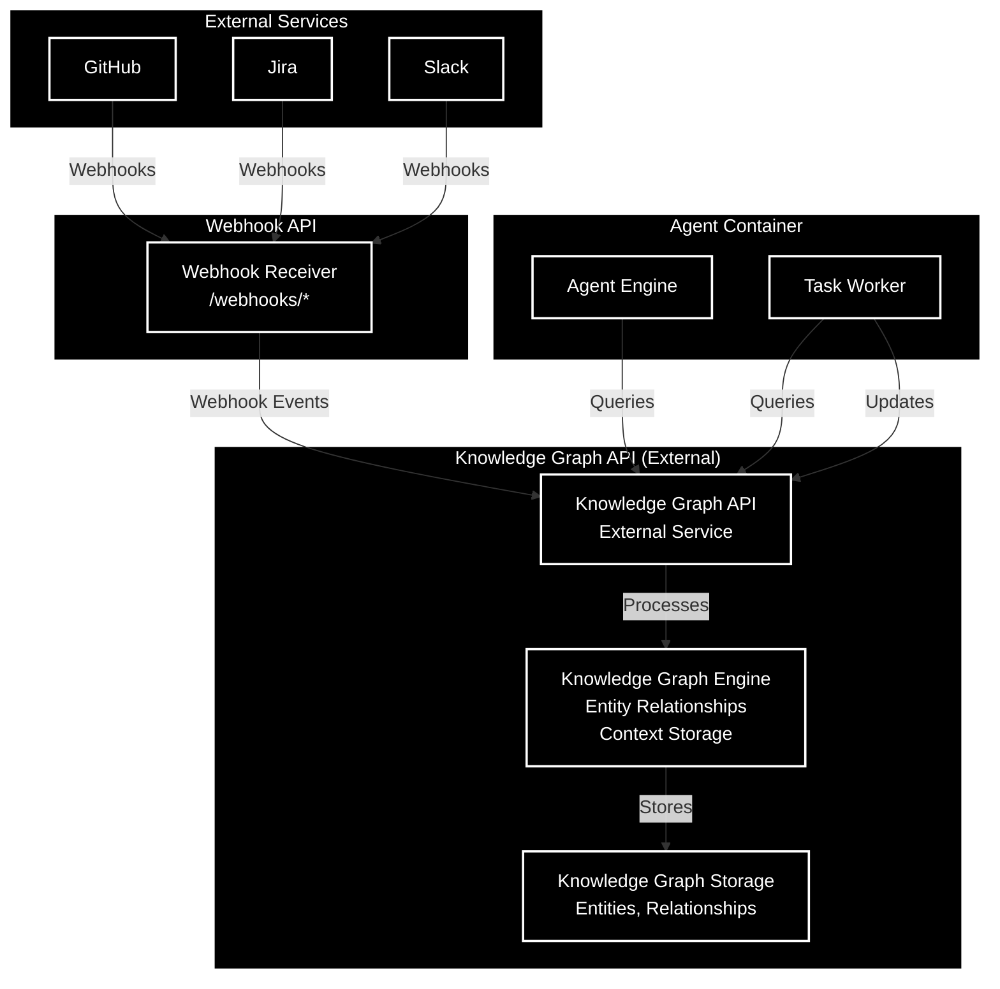

---

## 3. External Container (Full Details)

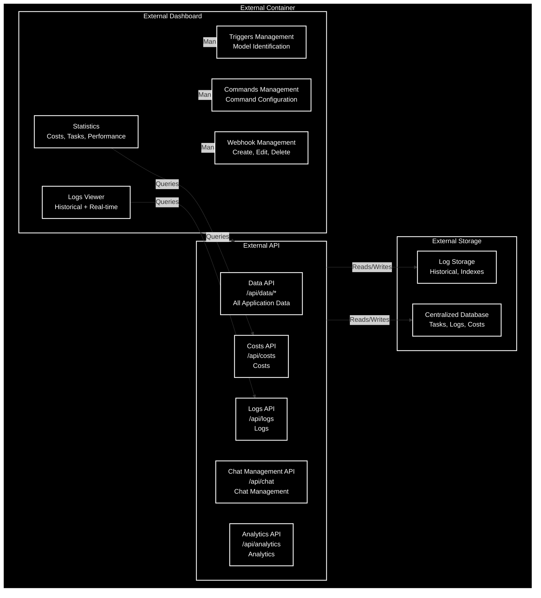

---

## 4. API Gateway - Central Entry Point

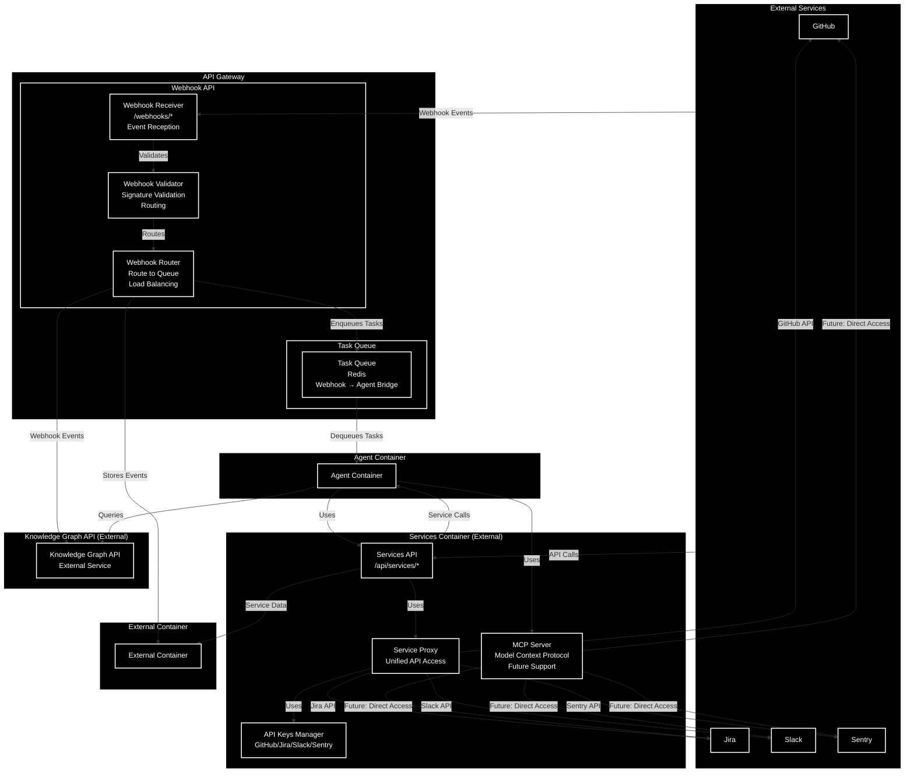

---

## 5. Data Flow

### 5.1 Webhook Event Flow

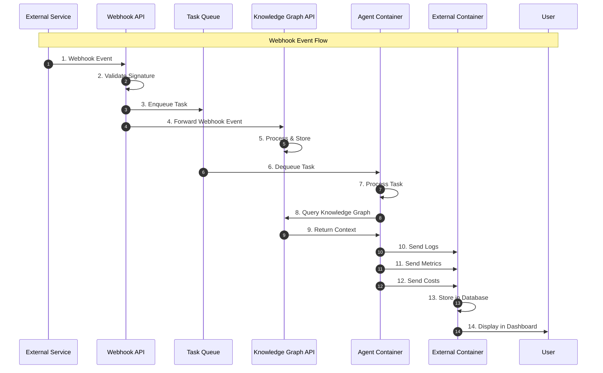

### 5.2 Statistics Viewing Flow

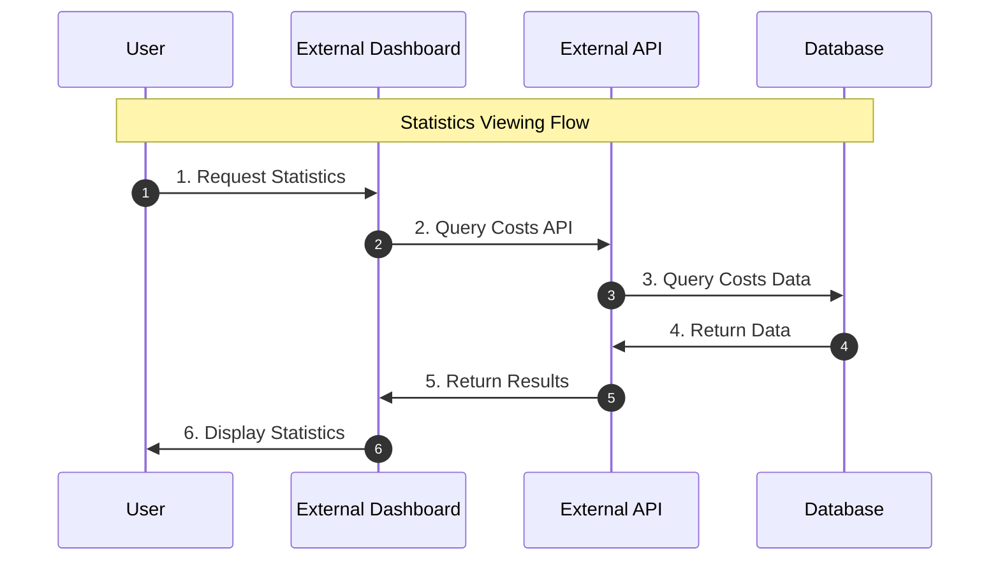

### 5.3 Chat with Agent Flow

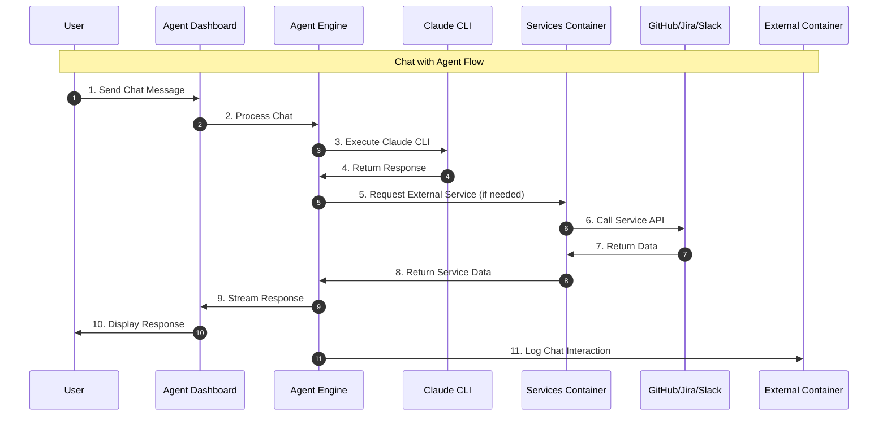

### 5.4 Webhook Management Flow

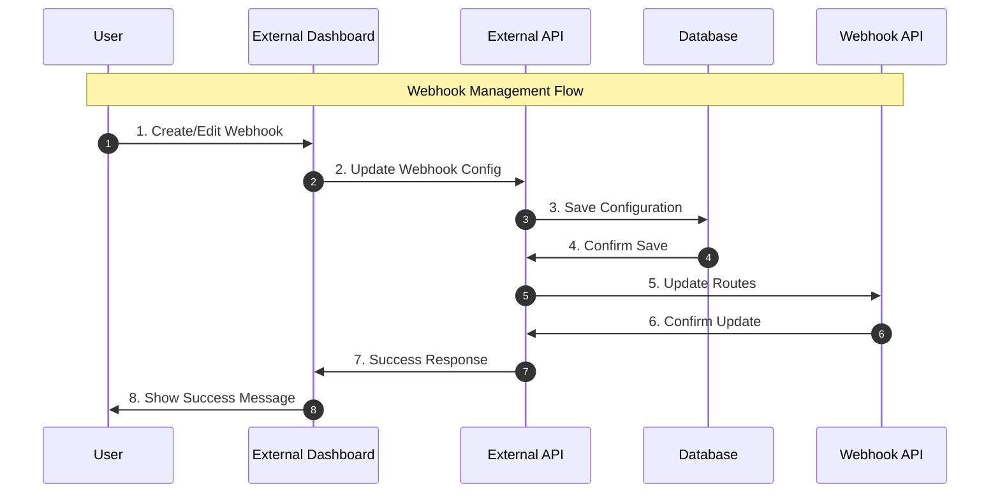

---

## 6. File Structure

```mermaid
graph TD
    Root["Root Directory<br/>/"]

    RootClaude["claude.md<br/>rules, commands, skills,<br/>agents, hooks, webhooks"]
    RootDocker["docker-compose.yml<br/>Container Orchestration"]
    RootEnv[".env<br/>Environment Variables"]
    RootMakefile["Makefile<br/>Management Commands"]

    AgentDir["agent-container/<br/>Agent Container Directory"]
    AgentDockerfile["Dockerfile<br/>Container Build"]
    AgentClaude["claude.md<br/>rules, skills, agent,<br/>commands, hooks"]
    AgentMain["main.py<br/>Entry Point"]
    AgentRequirements["requirements.txt<br/>Python Dependencies"]
    AgentConfig["config/<br/>Configuration Files"]
    AgentClaudeDir[".claude/<br/>Configuration Directory"]
    AgentRules[".claude/rules/<br/>Execution Rules"]
    AgentSkills[".claude/skills/<br/>Skills"]
    AgentAgents[".claude/agents/<br/>Agent Definitions"]

    ExternalDir["external-container/<br/>External Container Directory"]
    ExternalDockerfile["Dockerfile<br/>Container Build"]
    ExternalClaude["claude.md<br/>Configuration"]
    ExternalMain["main.py<br/>Entry Point"]
    ExternalDashboard["dashboard/<br/>React Dashboard"]
    ExternalAPI["api/<br/>API endpoints"]

    Root --> RootClaude
    Root --> RootDocker
    Root --> RootEnv
    Root --> RootMakefile
    Root --> AgentDir
    Root --> ExternalDir

    AgentDir --> AgentDockerfile
    AgentDir --> AgentClaude
    AgentDir --> AgentMain
    AgentDir --> AgentRequirements
    AgentDir --> AgentConfig
    AgentDir --> AgentClaudeDir
    AgentClaudeDir --> AgentRules
    AgentClaudeDir --> AgentSkills
    AgentClaudeDir --> AgentAgents
    AgentDir --> AgentTmp["tmp/<br/>Relevant Repositories"]

    ExternalDir --> ExternalDockerfile
    ExternalDir --> ExternalClaude
    ExternalDir --> ExternalMain
    ExternalDir --> ExternalDashboard
    ExternalDir --> ExternalAPI

    ServicesDir["services-container/<br/>Services Container<br/>External to API Gateway"]
    ServicesDockerfile["Dockerfile<br/>Services Container Build"]
    ServicesMain["main.py<br/>Services API Entry Point"]
    ServicesAPI["api/<br/>Services API endpoints"]
    ServicesMCP["mcp/<br/>MCP Server<br/>Future Support"]
    ServicesConfig["config/<br/>API Keys Configuration"]

    KGDir["knowledge-graph/<br/>Knowledge Graph Service<br/>External to Agent"]
    KGDockerfile["Dockerfile<br/>Knowledge Graph Build"]
    KGMain["main.py<br/>Knowledge Graph Engine"]
    KGStorage["storage/<br/>Knowledge Graph Storage"]

    Root --> ServicesDir
    Root --> KGDir
    ServicesDir --> ServicesDockerfile
    ServicesDir --> ServicesMain
    ServicesDir --> ServicesAPI
    ServicesDir --> ServicesMCP
    ServicesDir --> ServicesConfig
    KGDir --> KGDockerfile
    KGDir --> KGMain
    KGDir --> KGStorage

    RootClaude -.->|Defines| AgentClaude
    RootClaude -.->|Defines| ExternalClaude
    RootClaude -.->|Defines| ServicesDir

    classDef defaultNode fill:#000000,stroke:#ffffff,stroke-width:2px,color:#ffffff

    class Root,RootClaude,RootDocker,RootEnv,RootMakefile,AgentDir,AgentDockerfile,AgentClaude,AgentMain,AgentRequirements,AgentConfig,AgentClaudeDir,AgentRules,AgentSkills,AgentAgents,AgentTmp,ExternalDir,ExternalDockerfile,ExternalClaude,ExternalMain,ExternalDashboard,ExternalAPI,ServicesDir,ServicesDockerfile,ServicesMain,ServicesAPI,ServicesMCP,ServicesConfig,KGDir,KGDockerfile,KGMain,KGStorage defaultNode
```

---

## 7. Scaling Architecture

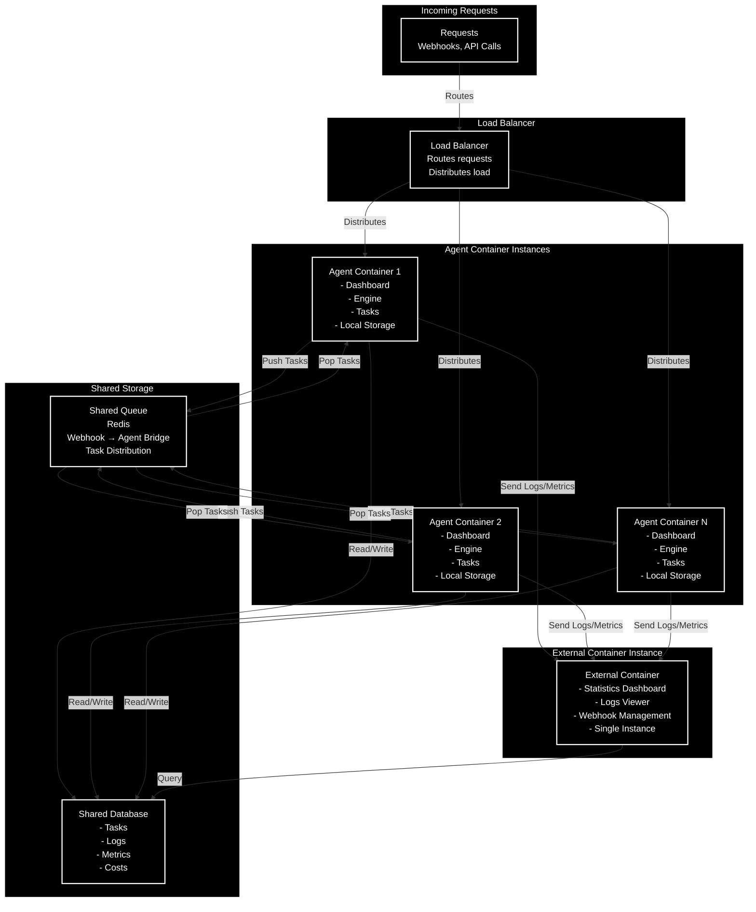

---

## 8. Services Container (External) - Detailed Architecture

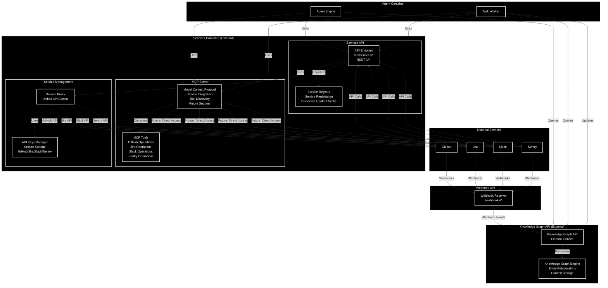

### Service Access Methods:

1. **MCP (Model Context Protocol)**
   - Direct integration with external services
   - Tool discovery and execution
   - No API key management needed in agent
   - Supports GitHub, Jira, Slack operations

2. **External Service with API Keys**
   - Centralized API key management
   - Service proxy for unified access
   - Secure credential storage
   - Supports all external services

---

## 9. Agent Capabilities & Resources

```mermaid
graph TB
    subgraph AgentContainer["Agent Container"]

        subgraph Skills["Available Skills"]
            direction LR
            GitHubSkill["github-operations<br/>PRs, Issues, Actions"]
            JiraSkill["jira-operations<br/>Issues, Sprints, Boards"]
            SlackSkill["slack-operations<br/>Messages, Channels"]
            WebhookSkill["webhook-management<br/>Create, Edit, Test"]
            TestingSkill["testing<br/>Test Creation, Validation"]
            VerificationSkill["verification<br/>Script-based Verification"]
            OtherSkills["... More Skills"]
        end

        subgraph Agents["Available Agents"]
            direction LR
            PlanningAgent["planning<br/>Task Planning"]
            ExecutorAgent["executor<br/>Task Execution"]
            VerifierAgent["verifier<br/>Verification"]
            GitHubIssueAgent["github-issue-handler<br/>Issue Management"]
            GitHubPRAgent["github-pr-review<br/>PR Review"]
            JiraCodeAgent["jira-code-plan<br/>Code Planning"]
            OtherAgents["... More Agents"]
        end

        subgraph Repositories["Repository Access"]
            direction TB
            TmpFolder["tmp/<br/>Temporary Storage"]
            Repo1["Repository 1<br/>Cloned for Task"]
            Repo2["Repository 2<br/>Cloned for Task"]
            RepoN["Repository N<br/>..."]
        end

        subgraph AgentEngine["Agent Engine"]
            Engine["Engine<br/>Orchestrates Skills & Agents"]
        end
    end

    subgraph WebhookAPI["Webhook API"]
        WebhookReceiver["Webhook Receiver<br/>/webhooks/*"]
    end

    subgraph KnowledgeGraph["Knowledge Graph API (External)"]
        direction TB
        KGAPI["Knowledge Graph API<br/>External Service"]
        KGEngine["Knowledge Graph Engine<br/>Entity Relationships<br/>Context Storage"]
        Entities["Entities<br/>People, Projects, Issues"]
        Relationships["Relationships<br/>Connections, Dependencies"]
        Context["Context<br/>Historical Information"]
    end

    subgraph ExternalServices["External Services"]
        GitHub["GitHub"]
        Jira["Jira"]
        Slack["Slack"]
    end

    GitHub -->|Webhooks| WebhookReceiver
    Jira -->|Webhooks| WebhookReceiver
    Slack -->|Webhooks| WebhookReceiver

    WebhookReceiver -->|Webhook Events| KGAPI
    KGAPI -->|Processes| KGEngine
    KGEngine -->|Manages| Entities
    KGEngine -->|Manages| Relationships
    KGEngine -->|Stores| Context

    AgentEngine -->|Loads| Skills
    AgentEngine -->|Loads| Agents
    AgentEngine -->|Manages| Repositories
    AgentEngine -->|Queries| KGAPI
    Engine -->|Queries| KGAPI
    Engine -->|Updates| KGAPI

    Skills -->|Can Use| GitHubSkill
    Skills -->|Can Use| JiraSkill
    Skills -->|Can Use| SlackSkill
    Skills -->|Can Use| WebhookSkill
    Skills -->|Can Use| TestingSkill
    Skills -->|Can Use| VerificationSkill

    Agents -->|Can Use| PlanningAgent
    Agents -->|Can Use| ExecutorAgent
    Agents -->|Can Use| VerifierAgent
    Agents -->|Can Use| GitHubIssueAgent
    Agents -->|Can Use| GitHubPRAgent
    Agents -->|Can Use| JiraCodeAgent

    TmpFolder -->|Contains| Repo1
    TmpFolder -->|Contains| Repo2
    TmpFolder -->|Contains| RepoN

    KGEngine -->|Manages| Entities
    KGEngine -->|Manages| Relationships
    KGEngine -->|Stores| Context

    classDef defaultNode fill:#000000,stroke:#ffffff,stroke-width:2px,color:#ffffff

    class AgentContainer,Skills,GitHubSkill,JiraSkill,SlackSkill,WebhookSkill,TestingSkill,VerificationSkill,OtherSkills,Agents,PlanningAgent,ExecutorAgent,VerifierAgent,GitHubIssueAgent,GitHubPRAgent,JiraCodeAgent,OtherAgents,Repositories,TmpFolder,Repo1,Repo2,RepoN,WebhookAPI,WebhookReceiver,KnowledgeGraph,KGAPI,KGEngine,Entities,Relationships,Context,AgentEngine,Engine,ExternalServices,GitHub,Jira,Slack defaultNode
```

### Agent Capabilities:

1. **Skills Library**
   - Pre-built skills for common operations
   - GitHub, Jira, Slack integrations
   - Webhook management
   - Testing and verification capabilities
   - Extensible through `.claude/skills/`

2. **Agent Library**
   - Specialized agents for different tasks
   - Planning, execution, verification agents
   - Domain-specific agents (GitHub, Jira)
   - Extensible through `.claude/agents/`

3. **Repository Access**
   - Can clone relevant repositories to `tmp/` folder
   - Isolated workspace per task
   - Automatic cleanup after task completion

4. **Knowledge Graph API (External)**
   - External API service separate from agent container
   - Receives data through webhooks from GitHub, Jira, and Slack
   - Webhook API forwards events to Knowledge Graph API
   - Entity relationship tracking
   - Context preservation across tasks
   - Historical information storage
   - Agent queries and updates knowledge graph through API

---

## 10. Configuration Management

```mermaid
graph TB
    subgraph RootConfig["Root Directory"]
        RootClaude["claude.md<br/>Global Configuration"]

        subgraph RootSections["Global Configuration Sections"]
            direction LR
            GlobalRules["Global Rules"]
            GlobalSkills["Global Skills"]
            GlobalAgents["Global Agents"]
            GlobalCommands["Global Commands"]
            GlobalHooks["Global Hooks"]
            GlobalWebhooks["Global Webhooks"]
        end
    end

    subgraph AgentConfig["Agent Container"]
        AgentClaude["claude.md<br/>Agent-specific Configuration"]

        subgraph AgentSections["Agent Configuration Sections"]
            direction LR
            AgentRules["Agent Rules"]
            AgentSkills["Agent Skills"]
            AgentCommands["Agent Commands"]
            AgentHooks["Agent Hooks"]
        end
    end

    subgraph ExternalConfig["External Container"]
        ExternalClaude["claude.md<br/>External Configuration"]

        subgraph ExternalSections["External Configuration Sections"]
            direction LR
            ExternalRules["External Rules"]
            ExternalConfigSect["External Config"]
        end
    end

    RootClaude -->|Inherits/Defines| AgentClaude
    RootClaude -->|Inherits/Defines| ExternalClaude

    RootClaude -->|Defines| GlobalRules
    RootClaude -->|Defines| GlobalSkills
    RootClaude -->|Defines| GlobalAgents
    RootClaude -->|Defines| GlobalCommands
    RootClaude -->|Defines| GlobalHooks
    RootClaude -->|Defines| GlobalWebhooks

    AgentClaude -->|Extends| AgentRules
    AgentClaude -->|Extends| AgentSkills
    AgentClaude -->|Extends| AgentCommands
    AgentClaude -->|Extends| AgentHooks

    ExternalClaude -->|Extends| ExternalRules
    ExternalClaude -->|Extends| ExternalConfigSect

    GlobalRules -.->|Base| AgentRules
    GlobalSkills -.->|Base| AgentSkills
    GlobalCommands -.->|Base| AgentCommands
    GlobalHooks -.->|Base| AgentHooks

    classDef defaultNode fill:#000000,stroke:#ffffff,stroke-width:2px,color:#ffffff

    class RootConfig,RootClaude,GlobalRules,GlobalSkills,GlobalAgents,GlobalCommands,GlobalHooks,GlobalWebhooks,AgentConfig,AgentClaude,AgentRules,AgentSkills,AgentCommands,AgentHooks,ExternalConfig,ExternalClaude,ExternalRules,ExternalConfigSect defaultNode
```

---

## 11. Summary

### Main Components:

1. **Agent Container**
   - Internal dashboard for managing agents, skills, rules
   - Direct chat interface with the agent
   - Real-time task logs
   - Task execution engine
   - Independent configuration (claude.md)
   - **Skills**: github-operations, jira-operations, slack-operations, webhook-management, testing, verification, and more
   - **Agents**: planning, executor, verifier, github-issue-handler, github-pr-review, jira-code-plan, and more
   - **Repository Access**: Can clone and work with relevant repositories in `tmp/` folder
   - **External Service Access**:
     - Through Services Container (External) - API or MCP
     - Accesses GitHub, Jira, Slack, Sentry services

2. **Task Queue**
   - Redis-based queue connecting webhooks to agents
   - Decouples webhook reception from agent processing
   - Enables load balancing and task distribution

3. **External Container**
   - Dashboard for statistics and costs
   - Historical logs viewing
   - Webhook, command, and trigger management
   - API for application data

4. **API Gateway**
   - Webhook API - event reception and routing to queue
   - Routes API calls to Services Container

5. **Services Container (External)**
   - External container separate from API Gateway
   - Services API endpoint `/api/services/*` - REST API
   - MCP Server for service integration (future support)
   - API Keys Manager for GitHub/Jira/Slack/Sentry
   - Service Proxy for unified API access
   - Provides access to external services (GitHub, Jira, Slack, Sentry)
   - Can work as API or MCP (Model Context Protocol)

6. **Knowledge Graph API (External Service)**
   - External API service separate from agent container
   - Receives data through webhooks from GitHub, Jira, and Slack
   - Webhook API forwards events to Knowledge Graph API
   - Entity relationship tracking
   - Context preservation across tasks
   - Historical information storage
   - Agent queries and updates knowledge graph through API

7. **Hierarchical Configuration**
   - Root claude.md - global settings
   - Agent claude.md - agent-specific settings
   - External claude.md - external settings

### Architecture Benefits:

- **Scaling**: Ability to run multiple agent instances
- **Separation**: Clear separation between execution (agent), monitoring (external), and service access (services container)
- **Flexibility**: Easy replacement of agent container, services container, and knowledge graph
- **Centralized Management**: Webhook and trigger management from one place
- **Modular Configuration**: Each container with its own claude.md
- **Queue-Based Architecture**: Decoupled webhook processing through task queue
- **Extensibility**: Skills and agents can be added dynamically
- **Repository Access**: Agents can work with cloned repositories in isolated tmp folders
- **Knowledge Management**: External Knowledge Graph API that receives data through webhooks from GitHub/Jira/Slack
- **Service Integration**: External Services Container provides unified access to GitHub/Jira/Slack/Sentry via API or MCP
- **Webhook-Based Knowledge Graph**: Knowledge Graph API receives events through webhooks, not direct API calls
- **External Services Container**: Separate container for service access, can work as REST API or MCP (future)
- **API Gateway Separation**: Webhook API in gateway, Services API in external container
