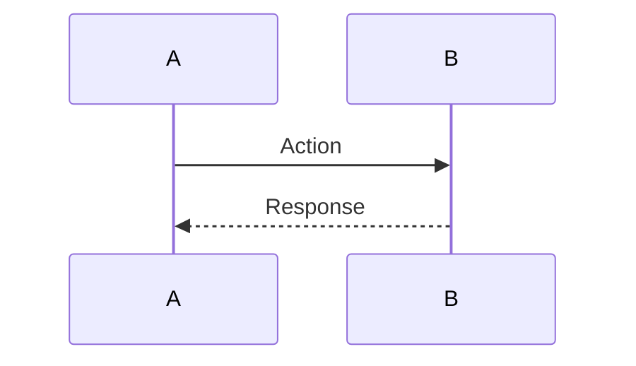

# Explain Command

## Trigger Patterns
- `@agent explain [code/feature/bug]`
- `@agent how does [X] work`
- `@agent what is [X]`
- `@agent explain this code`
- `@agent help me understand [X]`

## Behavior
Provide clear, comprehensive explanations of code, features, architecture, or concepts within the codebase.

## Parameters
- `--level <detail>`: Explanation detail level
  - `brief`: High-level overview (default)
  - `detailed`: In-depth explanation with examples
  - `technical`: Deep technical dive with implementation details
- `--format <type>`: Output format
  - `markdown`: Formatted markdown (default)
  - `diagram`: Include mermaid diagrams
  - `sequence`: Sequence diagram for workflows
- `--context <scope>`: Context scope
  - `local`: Current file/function only
  - `module`: Entire module
  - `system`: System-wide context

## Execution Flow

### 1. Identify Subject
- Parse user query to extract subject
- Determine subject type (function, class, workflow, concept)
- Locate relevant code/documentation
- Load historical context if available

### 2. Gather Context
- Read source code
- Query knowledge graph for relationships
- Load repository context and conventions
- Find usage examples
- Retrieve related documentation

### 3. Analysis
- Understand purpose and design
- Identify key components and dependencies
- Trace execution flow
- Extract important patterns
- Identify potential gotchas

### 4. Generate Explanation
- Structure explanation logically
- Include code examples
- Add diagrams if requested
- Provide usage examples
- Link to related concepts

## Explanation Structure

### For Functions/Methods
```markdown
## `function_name(args) -> return_type`

**Purpose:** [What it does]

**Location:** `file_path:line_number`

### Parameters
- `param1` (type): Description
- `param2` (type): Description

### Returns
- `return_type`: Description

### How It Works
1. Step 1 explanation
2. Step 2 explanation
3. Step 3 explanation

### Example Usage
```python
result = function_name(arg1, arg2)
```

### Dependencies
- Calls: [list of functions]
- Called by: [list of callers]
- Imports: [list of imports]

### Related Concepts
- [Link to concept 1]
- [Link to concept 2]

### Notes
- Edge cases to be aware of
- Performance considerations
- Common pitfalls
```

### For Workflows
```markdown
## Workflow: [Name]

**Description:** [What the workflow accomplishes]

### Flow Diagram


### Steps
1. **Trigger:** How the workflow starts
2. **Processing:** Main logic steps
3. **Completion:** Final actions and output

### Components Involved
- Component 1: Role
- Component 2: Role

### Data Flow
Input → Processing → Output

### Error Handling
- Error type 1: Handling strategy
- Error type 2: Handling strategy

### Example Scenario
[Concrete example walkthrough]
```

### For Architecture/Concepts
```markdown
## Concept: [Name]

**Definition:** [Clear definition]

### Why It's Used
[Problem it solves]

### How It Works
[Explanation with examples]

### Implementation in This Codebase
[Where and how it's used]

### Benefits
- Benefit 1
- Benefit 2

### Trade-offs
- Trade-off 1
- Trade-off 2

### Related Patterns
- Pattern 1
- Pattern 2
```

## Output Examples

### Brief Level
```markdown
## `process_task(task_data, mcp_client)`

This async function processes a single task by:
1. Logging task initialization
2. Executing the CLI with the task prompt
3. Posting results back to the source platform

**Key Dependencies:** TaskLogger, StreamingLogger, ClaudeCLIRunner, ResultPoster

**Location:** `workers/task_worker.py:28`
```

### Detailed Level
```markdown
## `process_task(task_data, mcp_client)` - Detailed Explanation

**Purpose:** Core task processing function that orchestrates the entire task lifecycle from initialization to result posting.

**Location:** `workers/task_worker.py:28-114`

### Function Signature
```python
async def process_task(task_data: dict, mcp_client: MCPClientProtocol) -> None
```

### Parameters
- `task_data` (dict): Task metadata including:
  - `task_id`: Unique identifier
  - `input_message`: User's request/prompt
  - `model`: Claude model to use
  - `source_metadata`: Origin information (GitHub PR, Jira issue, etc.)
- `mcp_client` (MCPClientProtocol): MCP client for posting results

### Execution Flow

#### 1. Initialization (lines 29-37)
Creates TaskLogger and StreamingLogger instances for the task. Logs initialization event to tracking stream.

#### 2. CLI Execution (lines 42-51)
Instantiates ClaudeCLIRunner and executes the task prompt in isolated environment (/app/tmp). Returns CLIResult with success status, output, and metrics.

#### 3. Result Logging (lines 57-72)
Logs execution outcome and writes final result with metrics (tokens, cost, success status) to task logs.

#### 4. Result Posting (lines 74-104)
If task succeeded and has source metadata:
- Determines provider (GitHub, Jira, Slack, Sentry)
- Creates ResultPoster with MCP client
- Posts result back to origin platform
- Logs posting success/failure

#### 5. Completion (lines 106-108)
Logs completion event with final status and closes streaming logger.

#### 6. Error Handling (lines 110-114)
Catches any exceptions, logs error, marks task as failed, logs completion with error.

### Example Flow (GitHub PR)
```
User comments "@agent review" on PR
  ↓
Webhook creates task_data with:
  - input_message: "review"
  - source_metadata: {provider: "github", pr_number: 123}
  ↓
process_task executes:
  1. Logs initialization
  2. Runs Claude CLI with "review" prompt
  3. Claude analyzes PR and generates review
  4. Posts review comment to GitHub PR #123
  5. Adds rocket emoji to PR
  6. Logs completion
```

### Dependencies
**Imports:**
- TaskLogger: Structured task logging
- StreamingLogger: Real-time event streaming
- ResultPoster: Post results to platforms
- ClaudeCLIRunner: Execute Claude CLI

**Called By:**
- `main()` in task_worker.py (the worker loop)

**Calls:**
- `TaskLogger.get_or_create()`
- `StreamingLogger.log_progress()`
- `ClaudeCLIRunner.execute()`
- `ResultPoster.post_result()`

### Error Scenarios
1. **CLI execution fails:** Logged as task_completed with success=False
2. **Result posting fails:** Logged but doesn't fail task
3. **Any exception:** Caught, logged, task marked failed

### Performance
- Typical execution: 30-120 seconds
- Depends on: CLI execution time, code complexity
- Async design: Non-blocking, allows concurrent task processing

### Notes
- Always closes streaming logger on completion/error
- Result posting failures don't fail the overall task
- Each task gets isolated working directory
```

### Technical Level
[Includes detailed implementation notes, algorithms used, performance characteristics, memory considerations, concurrency handling, etc.]

## Success Criteria
- Explanation is accurate and complete
- Appropriate level of detail for request
- Code examples are correct
- Diagrams (if requested) are accurate
- Generated within 2 minutes
- User comprehension achieved

## Escalation Conditions
- Cannot locate subject code → Request clarification or path
- Subject is ambiguous → Ask user to specify
- Complex algorithmic code → Provide detailed breakdown or request time
- Proprietary/sensitive context → Omit sensitive details, provide general explanation
