# Architecture Documentation with Mermaid Diagrams

This document provides comprehensive visual documentation of the Claude Code Agent architecture using Mermaid diagrams. It covers system architecture, component relationships, data flows, file usage, and dependencies.

---

## 1. System Architecture Overview

The Claude Code Agent is a self-managing machine where FastAPI runs as a daemon and Claude Code CLI is spawned on-demand per request.

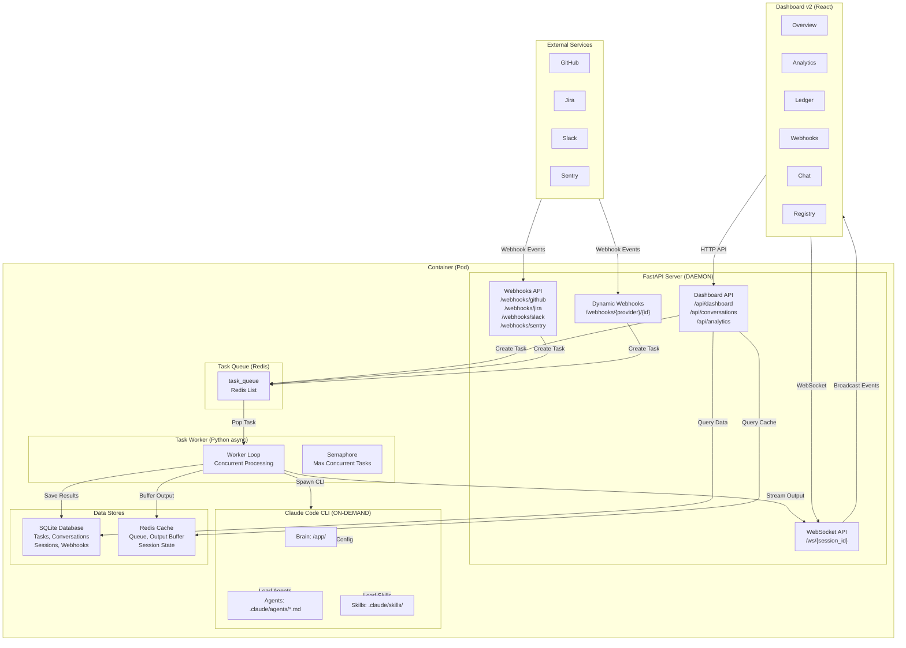

---

## 2. Component Relationships

This diagram shows how different modules interact within the system.

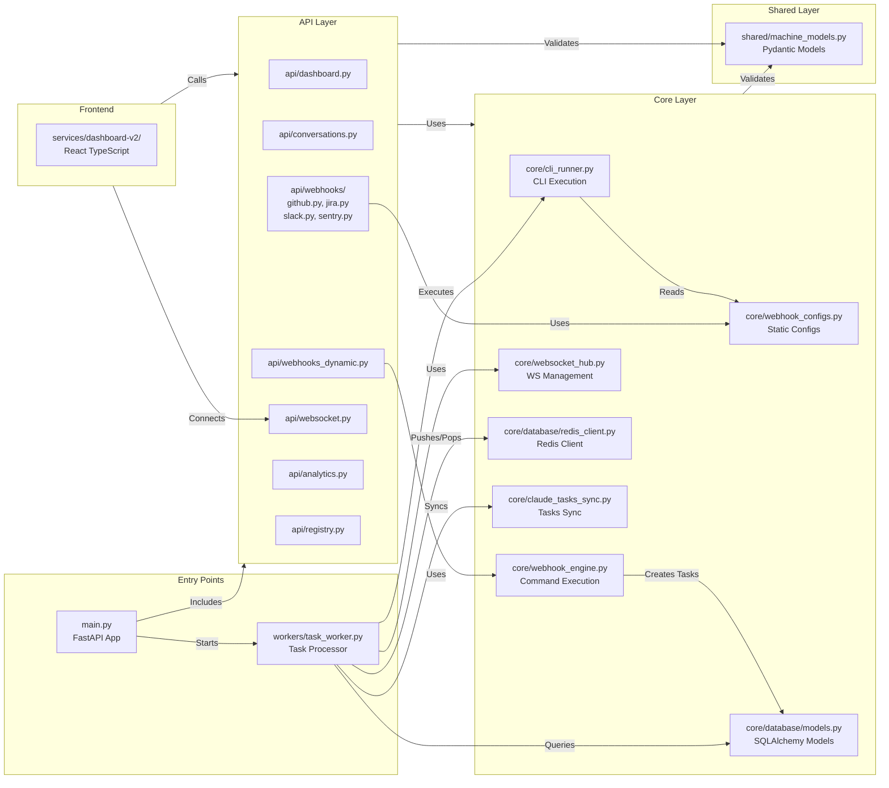

---

## 3. Data Flows

### 3.1 Dashboard Chat Flow

This sequence diagram shows the complete flow when a user sends a message through the dashboard.

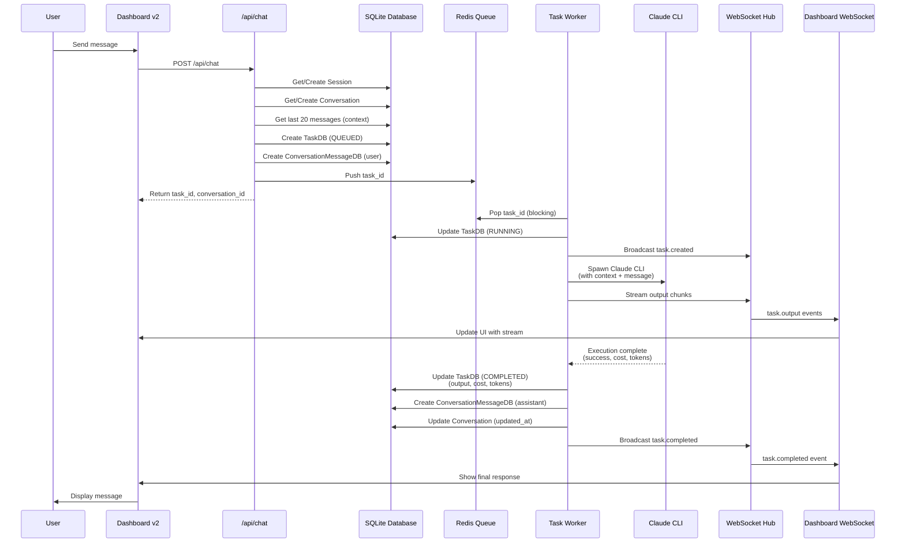

### 3.2 Webhook Flow (Static Routes)

This sequence diagram shows the flow when a webhook is received via static routes (hard-coded handlers).

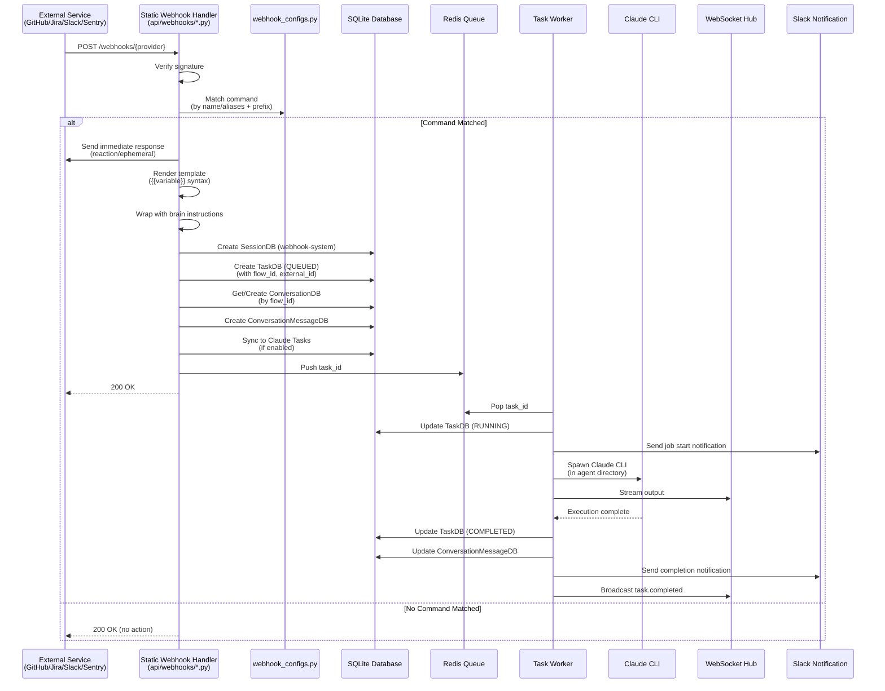

### 3.3 Webhook Flow (Dynamic Routes)

This sequence diagram shows the flow when a webhook is received via dynamic routes (database-driven).

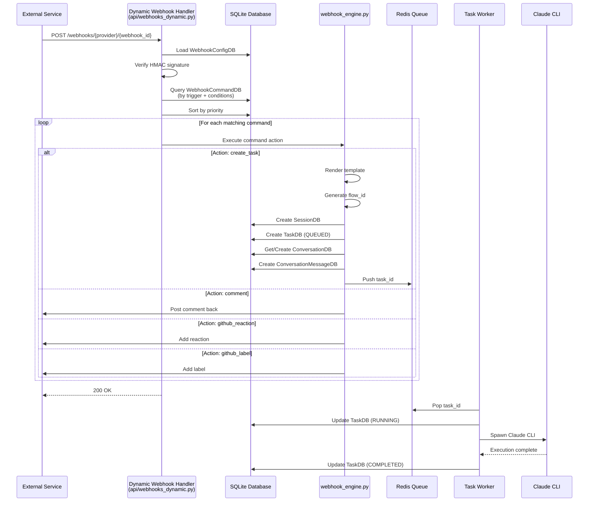

### 3.4 Task Processing Flow

This sequence diagram shows the detailed task processing flow from queue to completion.

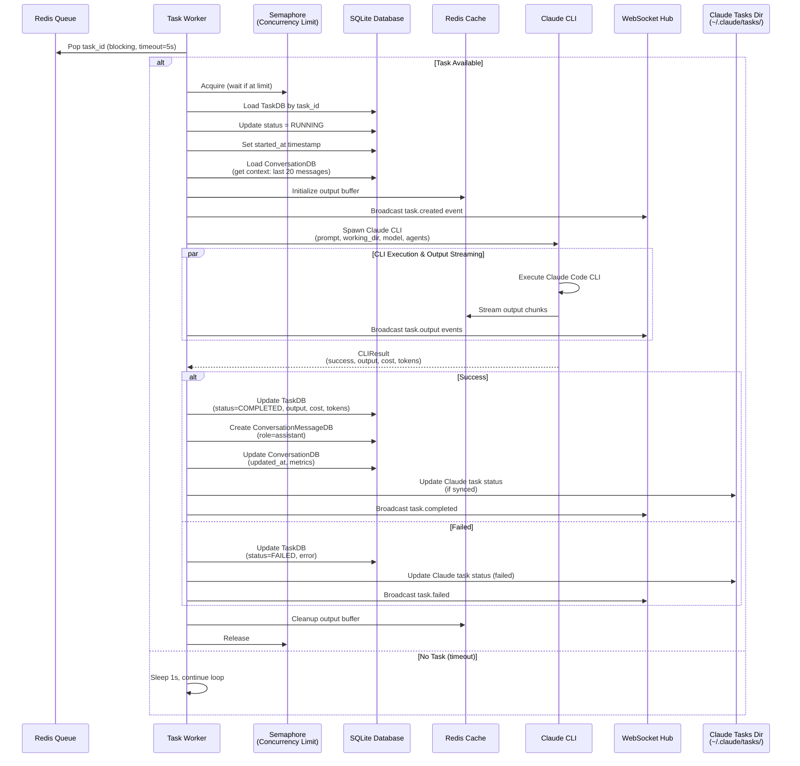

---

## 4. File Usage Map

This diagram shows which files are used by which components and features.

```mermaid
graph TB
    subgraph DashboardFeatures["Dashboard v2 Features"]
        OverviewFeature["Overview Feature"]
        AnalyticsFeature["Analytics Feature"]
        LedgerFeature["Ledger Feature"]
        WebhooksFeature["Webhooks Feature"]
        ChatFeature["Chat Feature"]
        RegistryFeature["Registry Feature"]
    end
    
    subgraph APIEndpoints["API Endpoints"]
        DashboardAPI["api/dashboard.py"]
        ConversationsAPI["api/conversations.py"]
        AnalyticsAPI["api/analytics.py"]
        WebhooksStaticAPI["api/webhooks/github.py<br/>api/webhooks/jira.py<br/>api/webhooks/slack.py<br/>api/webhooks/sentry.py"]
        WebhooksDynamicAPI["api/webhooks_dynamic.py"]
        WebSocketAPI["api/websocket.py"]
        RegistryAPI["api/registry.py"]
    end
    
    subgraph CoreModules["Core Modules"]
        CLIRunner["core/cli_runner.py"]
        WebhookEngine["core/webhook_engine.py"]
        WebhookConfigs["core/webhook_configs.py"]
        WebSocketHub["core/websocket_hub.py"]
        DatabaseModels["core/database/models.py"]
        RedisClient["core/database/redis_client.py"]
        ClaudeTasksSync["core/claude_tasks_sync.py"]
    end
    
    subgraph Workers["Workers"]
        TaskWorker["workers/task_worker.py"]
    end
    
    subgraph Shared["Shared"]
        MachineModels["shared/machine_models.py"]
    end
    
    subgraph Entry["Entry Points"]
        MainPy["main.py"]
    end
    
    OverviewFeature -->|GET /api/dashboard/status| DashboardAPI
    OverviewFeature -->|GET /api/tasks| DashboardAPI
    OverviewFeature -->|WebSocket| WebSocketAPI
    
    AnalyticsFeature -->|GET /api/analytics/*| AnalyticsAPI
    AnalyticsAPI -->|Queries| DatabaseModels
    
    LedgerFeature -->|GET /api/dashboard/tasks| DashboardAPI
    DashboardAPI -->|Queries| DatabaseModels
    
    WebhooksFeature -->|GET /api/webhooks| WebhooksDynamicAPI
    WebhooksFeature -->|POST /api/webhooks| WebhooksDynamicAPI
    WebhooksDynamicAPI -->|Uses| WebhookEngine
    WebhooksDynamicAPI -->|Queries| DatabaseModels
    
    ChatFeature -->|POST /api/chat| DashboardAPI
    ChatFeature -->|GET /api/conversations| ConversationsAPI
    ChatFeature -->|WebSocket| WebSocketAPI
    DashboardAPI -->|Creates Tasks| DatabaseModels
    ConversationsAPI -->|Manages| DatabaseModels
    
    RegistryFeature -->|GET /api/registry/*| RegistryAPI
    RegistryAPI -->|Reads/Writes| CoreModules
    
    WebhooksStaticAPI -->|Uses| WebhookConfigs
    WebhooksStaticAPI -->|Creates Tasks| DatabaseModels
    
    TaskWorker -->|Executes| CLIRunner
    TaskWorker -->|Uses| WebSocketHub
    TaskWorker -->|Queries| DatabaseModels
    TaskWorker -->|Pushes/Pops| RedisClient
    TaskWorker -->|Syncs| ClaudeTasksSync
    
    CLIRunner -->|Reads| WebhookConfigs
    
    WebhookEngine -->|Creates Tasks| DatabaseModels
    WebhookEngine -->|Uses| MachineModels
    
    MainPy -->|Includes| APIEndpoints
    MainPy -->|Starts| TaskWorker
    MainPy -->|Uses| CoreModules
    
    APIEndpoints -->|Validates| MachineModels
    CoreModules -->|Validates| MachineModels
    Workers -->|Uses| MachineModels
```

---

## 5. Component Dependencies

This diagram shows the dependency graph between modules, indicating which modules depend on others.

```mermaid
graph TD
    MainPy["main.py<br/>(Entry Point)"]
    TaskWorkerPy["workers/task_worker.py"]
    
    subgraph APIDeps["API Layer Dependencies"]
        DashboardAPI["api/dashboard.py"]
        ConversationsAPI["api/conversations.py"]
        WebhooksStatic["api/webhooks/*.py"]
        WebhooksDynamic["api/webhooks_dynamic.py"]
        WebSocketAPI["api/websocket.py"]
        AnalyticsAPI["api/analytics.py"]
        RegistryAPI["api/registry.py"]
    end
    
    subgraph CoreDeps["Core Layer Dependencies"]
        CLIRunner["core/cli_runner.py"]
        WebhookEngine["core/webhook_engine.py"]
        WebhookConfigs["core/webhook_configs.py"]
        WebSocketHub["core/websocket_hub.py"]
        DatabaseModels["core/database/models.py"]
        RedisClient["core/database/redis_client.py"]
        ClaudeTasksSync["core/claude_tasks_sync.py"]
        Config["core/config.py"]
    end
    
    subgraph SharedDeps["Shared Dependencies"]
        MachineModels["shared/machine_models.py"]
    end
    
    MainPy -->|Depends on| APIDeps
    MainPy -->|Depends on| CoreDeps
    MainPy -->|Starts| TaskWorkerPy
    
    TaskWorkerPy -->|Depends on| CLIRunner
    TaskWorkerPy -->|Depends on| WebSocketHub
    TaskWorkerPy -->|Depends on| DatabaseModels
    TaskWorkerPy -->|Depends on| RedisClient
    TaskWorkerPy -->|Depends on| ClaudeTasksSync
    TaskWorkerPy -->|Depends on| Config
    TaskWorkerPy -->|Depends on| MachineModels
    
    APIDeps -->|Depends on| CoreDeps
    APIDeps -->|Depends on| MachineModels
    
    WebhooksStatic -->|Depends on| WebhookConfigs
    WebhooksDynamic -->|Depends on| WebhookEngine
    WebSocketAPI -->|Depends on| WebSocketHub
    
    CoreDeps -->|Depends on| MachineModels
    CoreDeps -->|Depends on| Config
    
    WebhookEngine -->|Depends on| DatabaseModels
    WebhookEngine -->|Depends on| RedisClient
    WebhookEngine -->|Depends on| MachineModels
    
    CLIRunner -->|Depends on| Config
    
    DatabaseModels -->|Depends on| MachineModels
    RedisClient -->|Depends on| Config
    ClaudeTasksSync -->|Depends on| DatabaseModels
    ClaudeTasksSync -->|Depends on| Config
```

---

## 6. Key Files Reference

This table provides a quick reference for key files and their purposes.

| File Path | Purpose | Key Responsibilities |
|-----------|---------|---------------------|
| **Entry Points** |
| `main.py` | FastAPI application entry | Initialize app, register routers, start worker, handle lifespan |
| `workers/task_worker.py` | Task processing worker | Process tasks from queue, spawn CLI, stream output, update database |
| **API Layer** |
| `api/dashboard.py` | Dashboard API endpoints | Chat endpoint, task listing, status, agent listing |
| `api/conversations.py` | Conversation management | CRUD operations for conversations and messages |
| `api/webhooks/github.py` | GitHub webhook handler | Receive GitHub events, match commands, create tasks |
| `api/webhooks/jira.py` | Jira webhook handler | Receive Jira events, match commands, create tasks |
| `api/webhooks/slack.py` | Slack webhook handler | Receive Slack events, match commands, create tasks |
| `api/webhooks/sentry.py` | Sentry webhook handler | Receive Sentry events, match commands, create tasks |
| `api/webhooks_dynamic.py` | Dynamic webhook receiver | Handle database-driven webhooks, command matching |
| `api/websocket.py` | WebSocket endpoint | WebSocket connection handling, event broadcasting |
| `api/analytics.py` | Analytics API | Cost analytics, conversation analytics, usage patterns |
| `api/registry.py` | Registry API | Skills and agents CRUD operations |
| **Core Layer** |
| `core/cli_runner.py` | Claude CLI execution | Spawn Claude CLI process, capture output, calculate costs |
| `core/webhook_engine.py` | Webhook command execution | Execute webhook commands, render templates, create tasks |
| `core/webhook_configs.py` | Static webhook configs | Define hard-coded webhook configurations, validate at startup |
| `core/websocket_hub.py` | WebSocket hub | Manage WebSocket connections, broadcast events |
| `core/database/models.py` | Database models | SQLAlchemy ORM models (TaskDB, ConversationDB, etc.) |
| `core/database/redis_client.py` | Redis client | Redis connection, queue operations, output buffering |
| `core/claude_tasks_sync.py` | Claude Tasks sync | Sync orchestration tasks to ~/.claude/tasks/ directory |
| `core/config.py` | Configuration | Pydantic settings, environment variables, paths |
| **Shared Layer** |
| `shared/machine_models.py` | Domain models | Pydantic models with business rules (Task, Conversation, Session, etc.) |
| **Frontend** |
| `services/dashboard-v2/src/features/overview/` | Overview feature | System status, metrics, task monitoring |
| `services/dashboard-v2/src/features/analytics/` | Analytics feature | Cost analytics, conversation analytics |
| `services/dashboard-v2/src/features/ledger/` | Ledger feature | Transaction history, cost tracking |
| `services/dashboard-v2/src/features/webhooks/` | Webhooks feature | Webhook management UI |
| `services/dashboard-v2/src/features/chat/` | Chat feature | Conversation interface, message history |
| `services/dashboard-v2/src/features/registry/` | Registry feature | Skills and agents management |

---

## 7. Data Flow Summary

### Task Lifecycle States

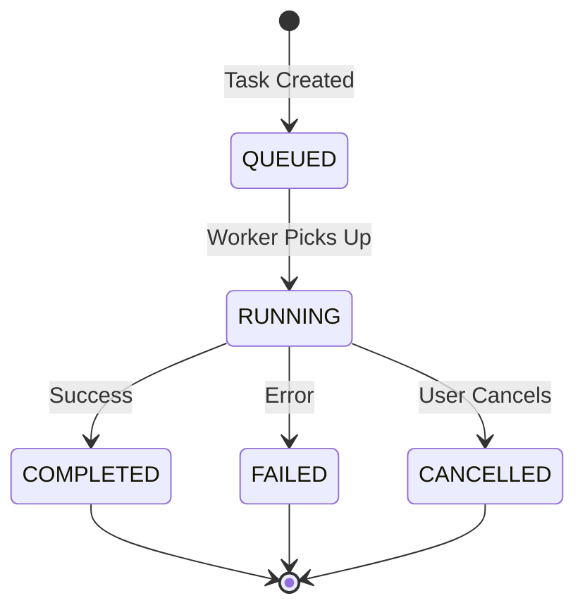

### Conversation Flow Tracking

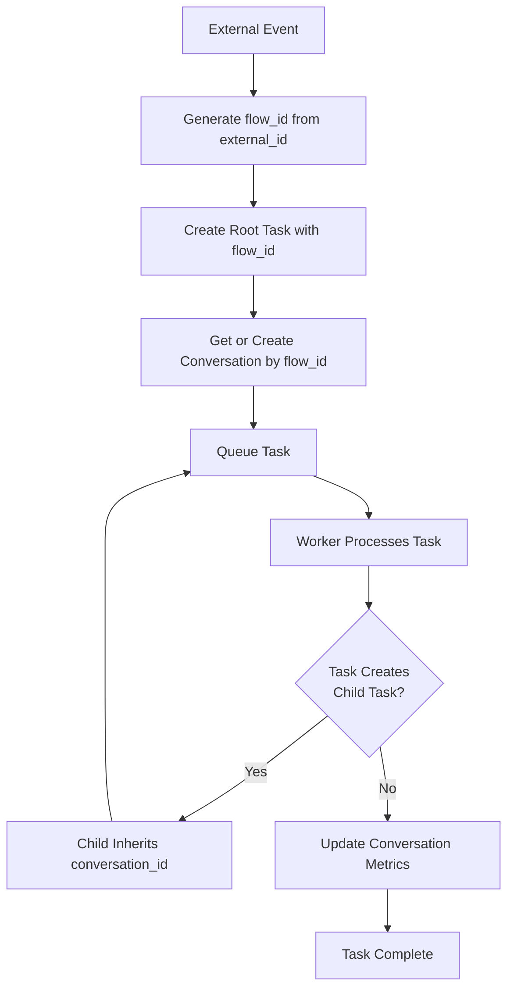

---

## 8. Storage Architecture

### SQLite Database Schema (Key Tables)

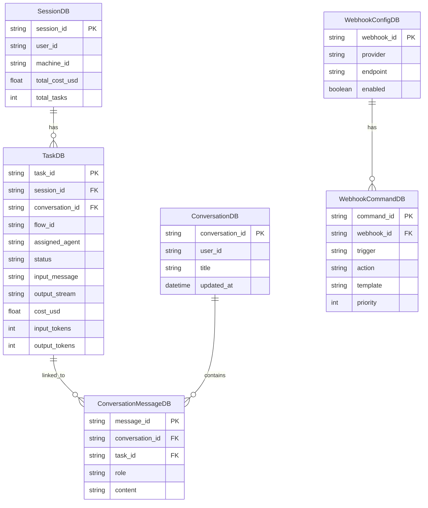

### Redis Usage

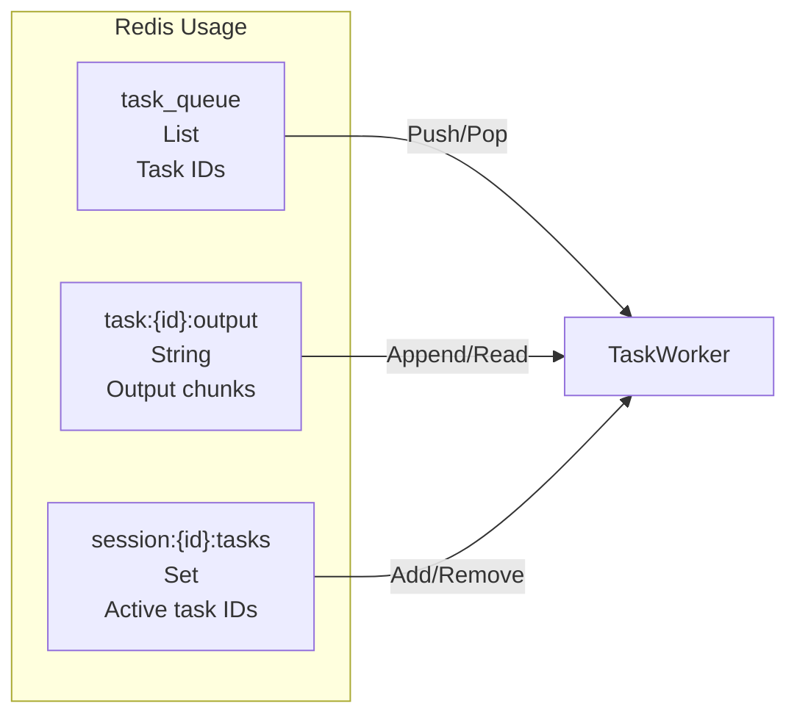

---

## 9. Agent System Architecture

### Agent Directory Structure

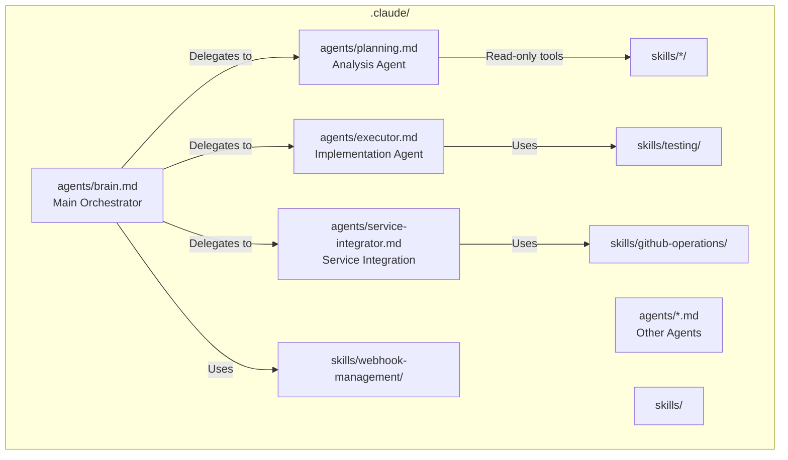

---

## Notes

- **Concurrency**: Task Worker uses a semaphore to limit concurrent tasks (default: 5)
- **Persistence**: SQLite for persistent data, Redis for ephemeral queue/cache
- **Real-time**: WebSocket for live updates, Redis for output buffering
- **Flow Tracking**: `flow_id` tracks end-to-end flows, `conversation_id` groups related tasks
- **Claude Tasks Sync**: Optional sync to `~/.claude/tasks/` for background agent visibility
- **Hybrid Webhooks**: Static routes (hard-coded) + Dynamic routes (database-driven)
- **Type Safety**: Pydantic models enforce business rules at the domain layer
