# Proposed Architecture - Detailed Mermaid Diagrams

Detailed architecture diagram according to requirements from todo.txt (lines 6-38)

---

## 1. Overview

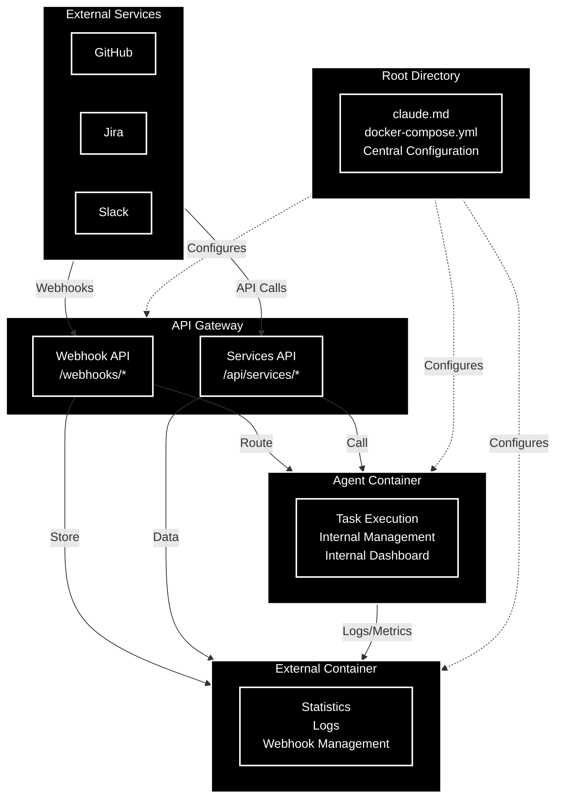

---

## 2. Agent Container (Full Details)

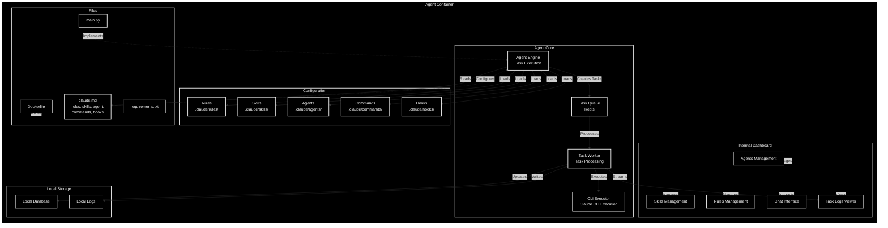

---

## 3. External Container (Full Details)

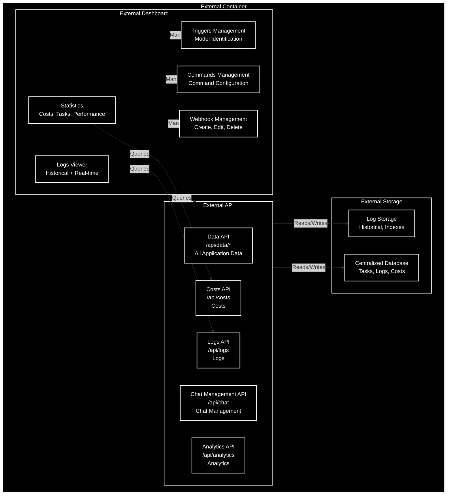

---

## 4. API Gateway - Central Entry Point

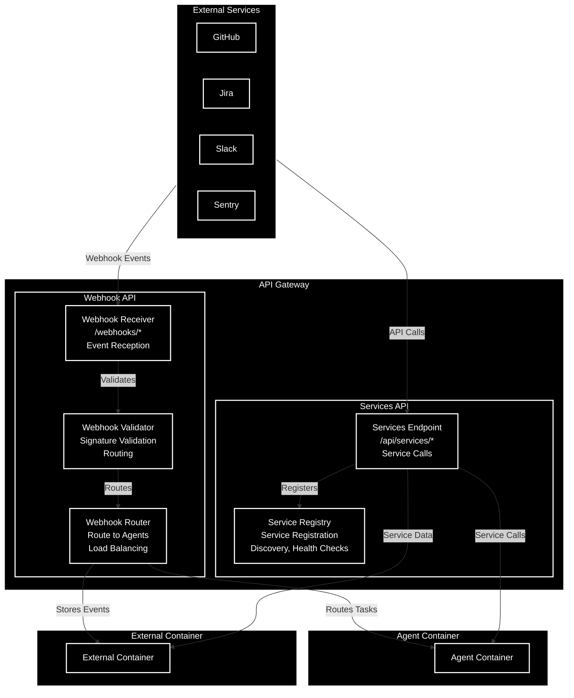

---

## 5. Data Flow

### 5.1 Webhook Event Flow

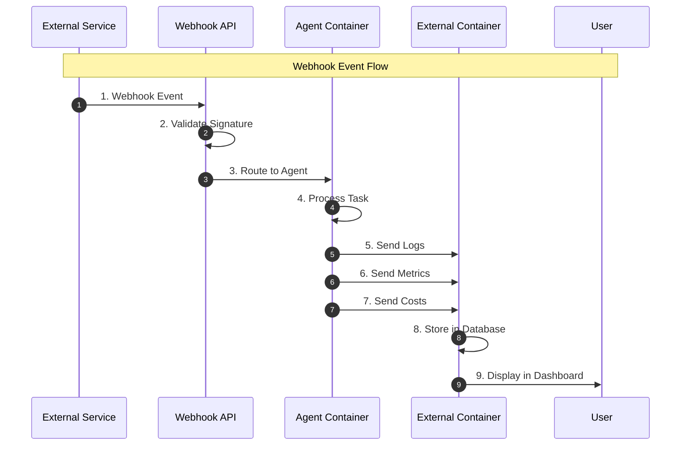

### 5.2 Statistics Viewing Flow

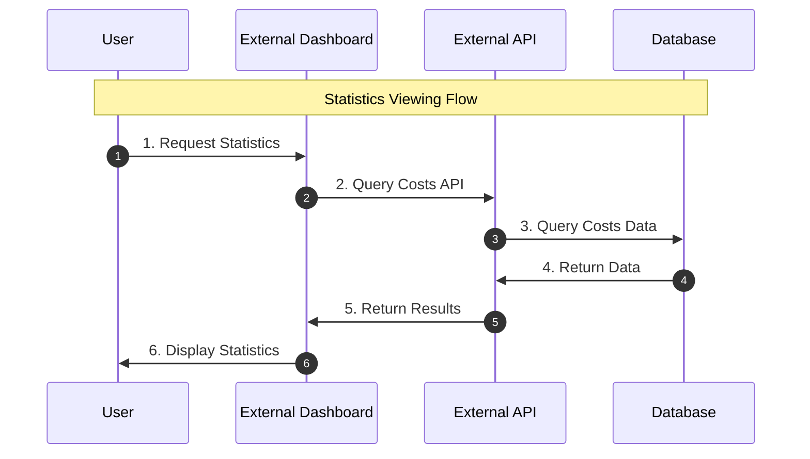

### 5.3 Chat with Agent Flow

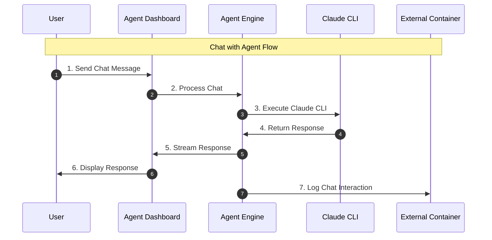

### 5.4 Webhook Management Flow

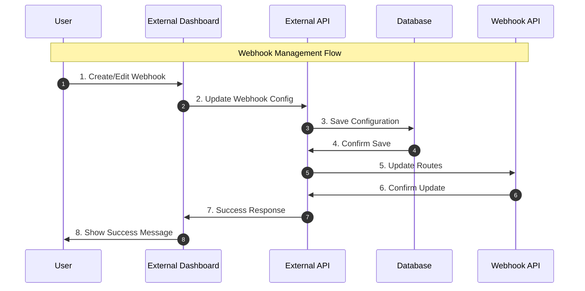

---

## 6. File Structure

```mermaid
graph TD
    Root["Root Directory<br/>/"]

    RootClaude["claude.md<br/>rules, commands, skills,<br/>agents, hooks, webhooks"]
    RootDocker["docker-compose.yml<br/>Container Orchestration"]
    RootEnv[".env<br/>Environment Variables"]
    RootMakefile["Makefile<br/>Management Commands"]

    AgentDir["agent-container/<br/>Agent Container Directory"]
    AgentDockerfile["Dockerfile<br/>Container Build"]
    AgentClaude["claude.md<br/>rules, skills, agent,<br/>commands, hooks"]
    AgentMain["main.py<br/>Entry Point"]
    AgentRequirements["requirements.txt<br/>Python Dependencies"]
    AgentConfig["config/<br/>Configuration Files"]
    AgentClaudeDir[".claude/<br/>Configuration Directory"]
    AgentRules[".claude/rules/<br/>Execution Rules"]
    AgentSkills[".claude/skills/<br/>Skills"]
    AgentAgents[".claude/agents/<br/>Agent Definitions"]

    ExternalDir["external-container/<br/>External Container Directory"]
    ExternalDockerfile["Dockerfile<br/>Container Build"]
    ExternalClaude["claude.md<br/>Configuration"]
    ExternalMain["main.py<br/>Entry Point"]
    ExternalDashboard["dashboard/<br/>React Dashboard"]
    ExternalAPI["api/<br/>API endpoints"]

    Root --> RootClaude
    Root --> RootDocker
    Root --> RootEnv
    Root --> RootMakefile
    Root --> AgentDir
    Root --> ExternalDir

    AgentDir --> AgentDockerfile
    AgentDir --> AgentClaude
    AgentDir --> AgentMain
    AgentDir --> AgentRequirements
    AgentDir --> AgentConfig
    AgentDir --> AgentClaudeDir
    AgentClaudeDir --> AgentRules
    AgentClaudeDir --> AgentSkills
    AgentClaudeDir --> AgentAgents

    ExternalDir --> ExternalDockerfile
    ExternalDir --> ExternalClaude
    ExternalDir --> ExternalMain
    ExternalDir --> ExternalDashboard
    ExternalDir --> ExternalAPI

    RootClaude -.->|Defines| AgentClaude
    RootClaude -.->|Defines| ExternalClaude

    classDef defaultNode fill:#000000,stroke:#ffffff,stroke-width:2px,color:#ffffff

    class Root,RootClaude,RootDocker,RootEnv,RootMakefile,AgentDir,AgentDockerfile,AgentClaude,AgentMain,AgentRequirements,AgentConfig,AgentClaudeDir,AgentRules,AgentSkills,AgentAgents,ExternalDir,ExternalDockerfile,ExternalClaude,ExternalMain,ExternalDashboard,ExternalAPI defaultNode
```

---

## 7. Scaling Architecture

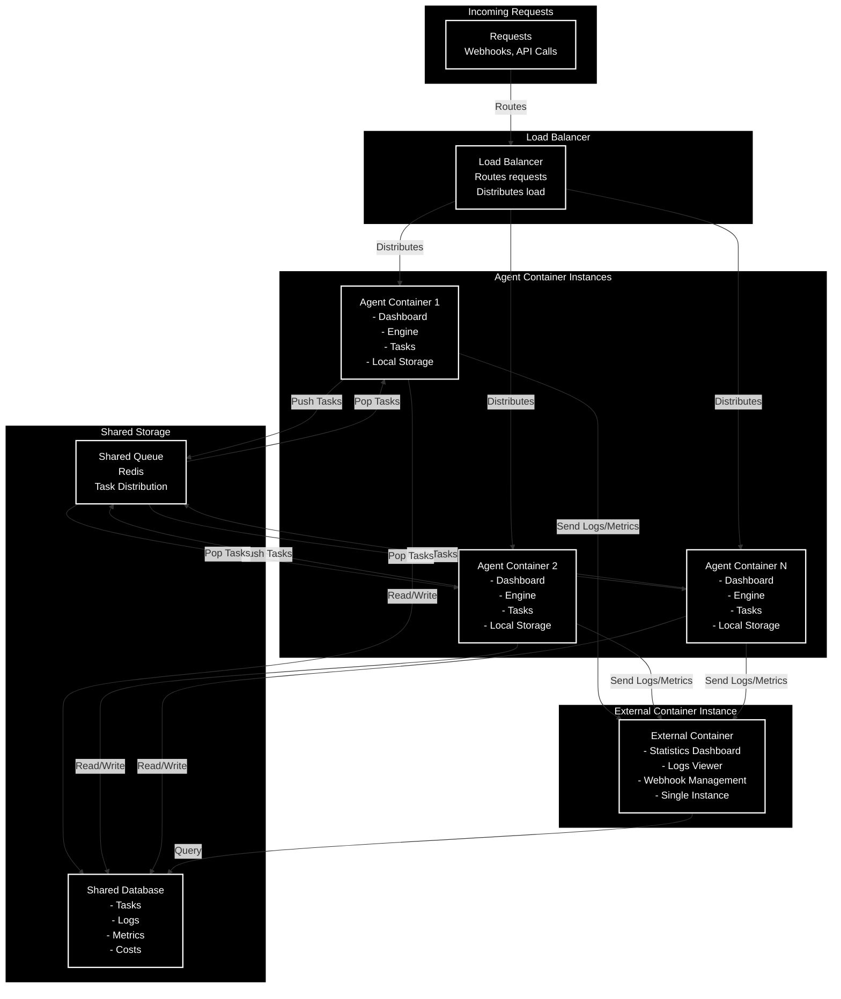

---

## 8. Configuration Management

```mermaid
graph TB
    subgraph RootConfig["Root Directory"]
        RootClaude["claude.md<br/>Global Configuration"]

        subgraph RootSections["Global Configuration Sections"]
            direction LR
            GlobalRules["Global Rules"]
            GlobalSkills["Global Skills"]
            GlobalAgents["Global Agents"]
            GlobalCommands["Global Commands"]
            GlobalHooks["Global Hooks"]
            GlobalWebhooks["Global Webhooks"]
        end
    end

    subgraph AgentConfig["Agent Container"]
        AgentClaude["claude.md<br/>Agent-specific Configuration"]

        subgraph AgentSections["Agent Configuration Sections"]
            direction LR
            AgentRules["Agent Rules"]
            AgentSkills["Agent Skills"]
            AgentCommands["Agent Commands"]
            AgentHooks["Agent Hooks"]
        end
    end

    subgraph ExternalConfig["External Container"]
        ExternalClaude["claude.md<br/>External Configuration"]

        subgraph ExternalSections["External Configuration Sections"]
            direction LR
            ExternalRules["External Rules"]
            ExternalConfigSect["External Config"]
        end
    end

    RootClaude -->|Inherits/Defines| AgentClaude
    RootClaude -->|Inherits/Defines| ExternalClaude

    RootClaude -->|Defines| GlobalRules
    RootClaude -->|Defines| GlobalSkills
    RootClaude -->|Defines| GlobalAgents
    RootClaude -->|Defines| GlobalCommands
    RootClaude -->|Defines| GlobalHooks
    RootClaude -->|Defines| GlobalWebhooks

    AgentClaude -->|Extends| AgentRules
    AgentClaude -->|Extends| AgentSkills
    AgentClaude -->|Extends| AgentCommands
    AgentClaude -->|Extends| AgentHooks

    ExternalClaude -->|Extends| ExternalRules
    ExternalClaude -->|Extends| ExternalConfigSect

    GlobalRules -.->|Base| AgentRules
    GlobalSkills -.->|Base| AgentSkills
    GlobalCommands -.->|Base| AgentCommands
    GlobalHooks -.->|Base| AgentHooks

    classDef defaultNode fill:#000000,stroke:#ffffff,stroke-width:2px,color:#ffffff

    class RootConfig,RootClaude,GlobalRules,GlobalSkills,GlobalAgents,GlobalCommands,GlobalHooks,GlobalWebhooks,AgentConfig,AgentClaude,AgentRules,AgentSkills,AgentCommands,AgentHooks,ExternalConfig,ExternalClaude,ExternalRules,ExternalConfigSect defaultNode
```

---

## 9. Summary

### Main Components:

1. **Agent Container**
   - Internal dashboard for managing agents, skills, rules
   - Direct chat interface with the agent
   - Real-time task logs
   - Task execution engine
   - Independent configuration (claude.md)

2. **External Container**
   - Dashboard for statistics and costs
   - Historical logs viewing
   - Webhook, command, and trigger management
   - API for application data

3. **API Gateway**
   - Webhook API - event reception and routing
   - Services API - service calls

4. **Hierarchical Configuration**
   - Root claude.md - global settings
   - Agent claude.md - agent-specific settings
   - External claude.md - external settings

### Architecture Benefits:

- **Scaling**: Ability to run multiple agent instances
- **Separation**: Clear separation between execution (agent) and monitoring (external)
- **Flexibility**: Easy replacement of agent container
- **Centralized Management**: Webhook and trigger management from one place
- **Modular Configuration**: Each container with its own claude.md
