# Multiple-Agents System - Architecture & Process Flow

> **Purpose**: Production-grade distributed multi-agent system running on AWS infrastructure for autonomous software development.

---

## Table of Contents

1. [Overview](#overview)
2. [AWS Infrastructure](#aws-infrastructure)
3. [System Architecture](#system-architecture)
4. [Agent Details](#agent-details)
5. [Workflow Orchestration](#workflow-orchestration)
6. [MCP Tools & AgentCore](#mcp-tools--agentcore)
7. [Event Triggers](#event-triggers)
8. [Data Flow](#data-flow)
9. [Security & Secrets](#security--secrets)
10. [Monitoring & Observability](#monitoring--observability)

---

## Overview

### What is the Multiple-Agents System?

The Multiple-Agents System is a **production-grade, distributed autonomous development platform** that:

- Automatically processes Jira tickets with the "AI" label
- Discovers relevant repositories and code patterns
- Creates TDD implementation plans
- Generates code following the approved plan
- Monitors CI/CD pipelines and attempts auto-fixes
- Creates Jira tickets for recurring Sentry errors
- Communicates via Slack for approvals and notifications

### Key Characteristics

| Aspect | Description |
|--------|-------------|
| **Deployment** | AWS (Lambda, Step Functions, DynamoDB, API Gateway) |
| **LLM Provider** | AWS Bedrock (Claude models) |
| **State Management** | DynamoDB with TTL |
| **Orchestration** | AWS Step Functions |
| **Tool Access** | AWS AgentCore MCP Gateway |
| **Triggers** | Webhooks, EventBridge, Slack |

---

## AWS Infrastructure

### Infrastructure Diagram

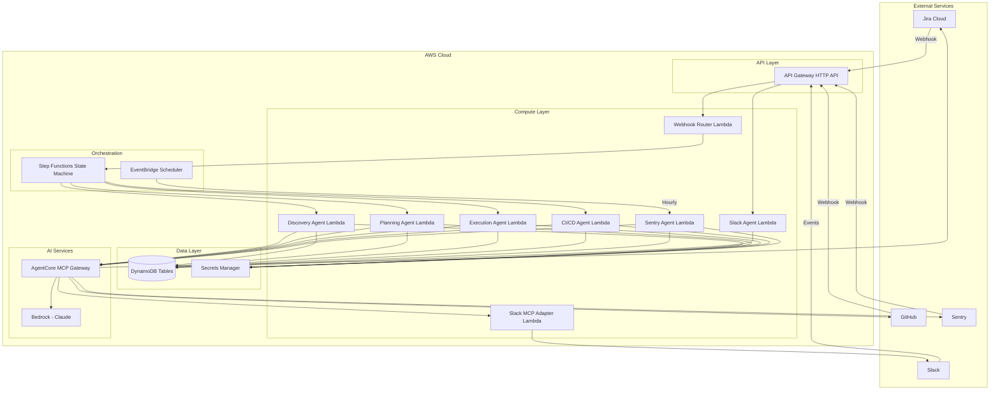

### AWS Services Used

| Service | Purpose | Configuration |
|---------|---------|---------------|
| **API Gateway** | HTTP API for webhooks | Routes: `/webhooks/*` |
| **Lambda** | Agent execution | Runtime: Python 3.11 |
| **Step Functions** | Workflow orchestration | Standard workflow |
| **DynamoDB** | State storage | On-demand capacity |
| **Secrets Manager** | API keys storage | Rotation enabled |
| **EventBridge** | Scheduled triggers | Hourly for Sentry |
| **Bedrock** | LLM inference | Claude Opus/Sonnet |
| **AgentCore** | MCP tool gateway | Managed service |
| **CloudWatch** | Logging & metrics | Log retention: 30d |

### DynamoDB Tables

#### Tasks Table

```
Table: enterprise-agentcore-tasks
Primary Key: pk (String) - "TASK#{task_id}"
Sort Key: sk (String) - "METADATA" | "PHASE#{phase}"

Attributes:
- task_id (String)
- ticket_id (String)
- status (String)
- current_agent (String)
- progress (Number)
- created_at (String ISO)
- ttl (Number) - Unix timestamp for auto-deletion
```

#### Error Tracking Table

```
Table: enterprise-agentcore-errors
Primary Key: error_fingerprint (String)

Attributes:
- ticket_id (String) - Created Jira ticket
- created_at (String ISO)
- ttl (Number) - 90 days
```

---

## System Architecture

### Directory Structure

```
multiple-agents-system/
├── config/
│   └── settings.py              # Centralized configuration
│
├── agents/
│   ├── shared/
│   │   └── gateway.py           # AgentCore gateway wrapper
│   │
│   ├── discovery_agent/
│   │   └── main.py              # Discovery Lambda handler
│   │
│   ├── planning_agent/
│   │   └── main.py              # Planning Lambda handler
│   │
│   ├── execution_agent/
│   │   └── main.py              # Execution Lambda handler
│   │
│   ├── cicd_agent/
│   │   └── main.py              # CI/CD Lambda handler
│   │
│   ├── sentry_agent/
│   │   └── main.py              # Sentry Lambda handler
│   │
│   └── slack_agent/
│       └── main.py              # Slack Lambda handler
│
├── lambda/
│   ├── webhook-router/
│   │   └── handler.py           # Webhook routing Lambda
│   │
│   └── slack-mcp-adapter/
│       └── handler.py           # Slack MCP adapter
│
├── prompts/
│   ├── discovery/
│   │   └── system.md            # Discovery agent prompt
│   ├── planning/
│   │   ├── system.md            # Planning agent prompt
│   │   └── task.md              # Task prompt template
│   ├── execution/
│   │   ├── system.md            # Execution agent prompt
│   │   └── task.md              # Task prompt template
│   ├── cicd/
│   │   └── system.md            # CI/CD agent prompt
│   ├── sentry/
│   │   └── system.md            # Sentry agent prompt
│   └── slack/
│       └── system.md            # Slack agent prompt
│
├── terraform/
│   ├── main.tf                  # Main infrastructure
│   ├── lambda.tf                # Lambda functions
│   ├── api_gateway.tf           # API Gateway
│   ├── step_functions.tf        # State machine
│   ├── dynamodb.tf              # DynamoDB tables
│   └── iam.tf                   # IAM roles
│
└── tests/
    └── ...                      # Test suites
```

### Component Architecture

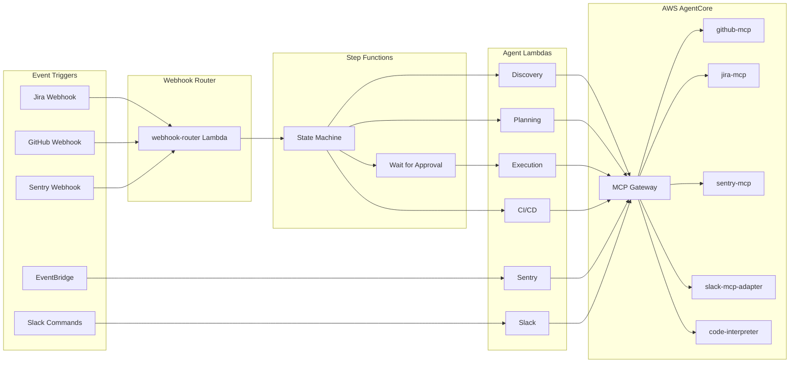

---

## Agent Details

### AgentCore Gateway (`agents/shared/gateway.py`)

The shared gateway provides access to MCP tools and AgentCore services.

```python
class AgentCoreGateway:
    """Gateway for accessing MCP tools and AgentCore services."""
    
    def __init__(self):
        self.secrets = self._load_secrets()
        self._init_tools()
    
    def _load_secrets(self) -> Dict[str, str]:
        """Load secrets from AWS Secrets Manager."""
        client = boto3.client('secretsmanager')
        response = client.get_secret_value(SecretId=settings.secrets.secret_arn)
        return json.loads(response['SecretString'])
    
    def get_tool(self, tool_name: str) -> MCPTool:
        """Get an MCP tool by name."""
        return self._tools[tool_name]
    
    def invoke_tool(self, tool_name: str, method: str, **kwargs) -> Any:
        """Invoke a tool method."""
        tool = self.get_tool(tool_name)
        return getattr(tool, method)(**kwargs)
    
    def get_service(self, service_name: str) -> Any:
        """Get an AgentCore service."""
        return self._services[service_name]
```

### Discovery Agent

**Lambda Handler**: `agents/discovery_agent/main.py`

**Trigger**: Step Functions (first step after webhook)

**Purpose**: Find all relevant repositories and files for a ticket.

**Process Flow**:

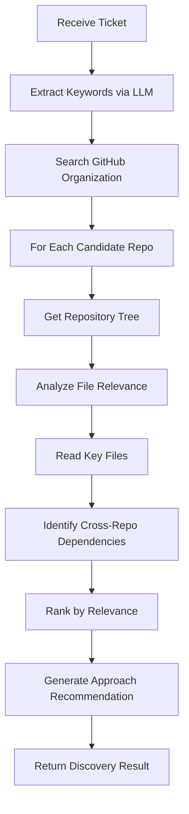

**MCP Tools Used**:
- `github-mcp.search_code()`
- `github-mcp.get_repo()`
- `github-mcp.get_tree()`
- `github-mcp.get_file_content()`

**Output Schema**:
```json
{
  "relevantRepos": [
    {
      "name": "auth-service",
      "relevance": 0.95,
      "reason": "Contains OAuth implementation",
      "languages": ["TypeScript", "Python"],
      "files": [
        {"path": "src/auth/oauth.ts", "type": "source", "relevance": 0.9}
      ]
    }
  ],
  "crossRepoDependencies": [
    {"from": "frontend", "to": "auth-service", "type": "API"}
  ],
  "estimatedComplexity": "Medium",
  "recommendedApproach": "Modify OAuth flow in auth-service, update frontend components",
  "keywords": ["OAuth", "authentication", "login"]
}
```

---

### Planning Agent

**Lambda Handler**: `agents/planning_agent/main.py`

**Trigger**: Step Functions (after Discovery)

**Purpose**: Create comprehensive TDD implementation plan.

**Process Flow**:

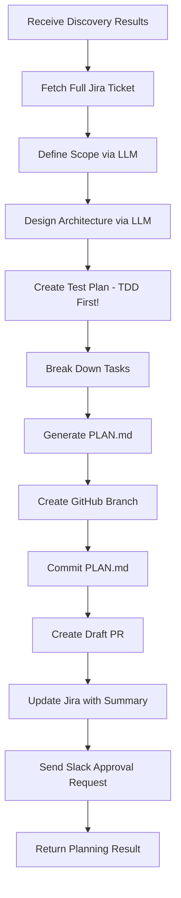

**MCP Tools Used**:
- `jira-mcp.get_issue()`
- `github-mcp.create_branch()`
- `github-mcp.create_or_update_file()`
- `github-mcp.create_pull_request()`
- `jira-mcp.add_comment()`
- `slack.send_message()` (via adapter)

**PLAN.md Template**:
```markdown
# {TICKET_ID}: {Summary}

## Summary
{description}

## Scope
### In Scope
- ✅ {item}

### Out of Scope  
- ❌ {item}

## Architecture
### Components
| Component | Path | Responsibility |
|-----------|------|----------------|
| {name} | {path} | {responsibility} |

### Data Flow
{diagram or description}

## Test Plan (TDD)
### Unit Tests
- [ ] {test_description}

### Integration Tests
- [ ] {test_description}

## Implementation Tasks
| # | Task | Dependencies | Est. Hours |
|---|------|--------------|------------|
| 1 | Write tests for X | - | 2 |
| 2 | Implement X | 1 | 4 |

## Security Considerations
- [ ] Input validation
- [ ] Auth checks
- [ ] Data encryption

## Rollback Plan
{steps}
```

---

### Execution Agent

**Lambda Handler**: `agents/execution_agent/main.py`

**Trigger**: Step Functions (after approval)

**Purpose**: Implement code according to approved plan.

**Process Flow**:

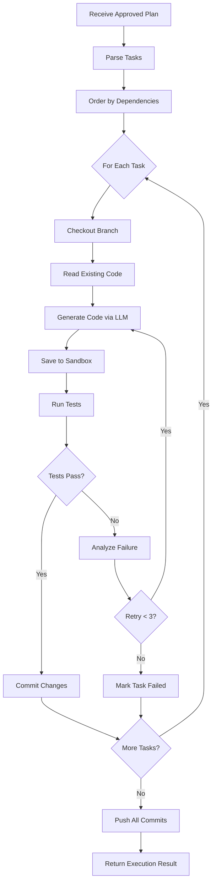

**MCP Tools Used**:
- `github-mcp.get_file_content()`
- `github-mcp.create_or_update_file()`
- `code-interpreter.execute()` (for running tests)
- `github-mcp.create_commit()`

**Code Generation Prompt Pattern**:
```markdown
## Task
{task_description}

## File to Modify
Path: {file_path}
Current Content:
```{language}
{existing_code}
```

## Requirements
1. Follow existing patterns
2. Handle edge cases
3. Add error handling
4. Include type annotations
5. Add comments for complex logic

## Test File Reference
```{language}
{related_test_code}
```

## Output
Complete file content only:
```

---

### CI/CD Agent

**Lambda Handler**: `agents/cicd_agent/main.py`

**Trigger**: Step Functions (after PR creation) OR GitHub webhook (workflow completion)

**Purpose**: Monitor CI/CD, attempt auto-fixes, escalate when needed.

**Process Flow**:

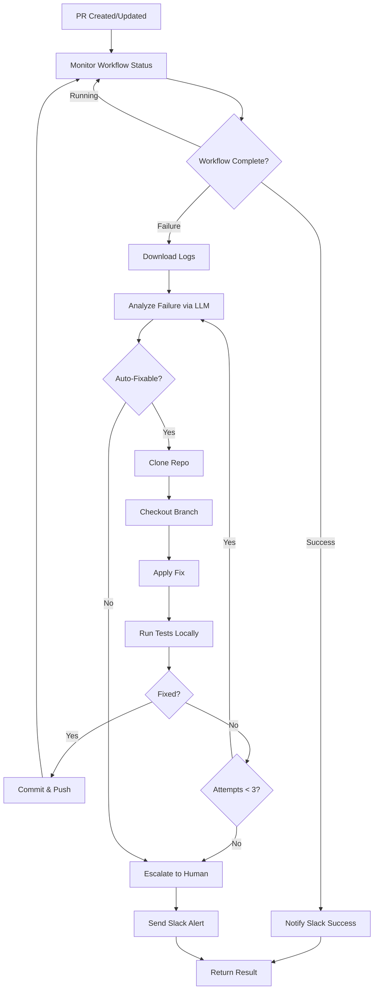

**Auto-Fix Categories**:

| Issue Type | Detection Pattern | Fix Command |
|------------|-------------------|-------------|
| ESLint | `error.*eslint` | `npx eslint --fix .` |
| Prettier | `error.*prettier` | `npx prettier --write .` |
| Ruff (Python) | `ruff check` | `ruff check --fix .` |
| Black (Python) | `would reformat` | `black .` |
| isort | `isort` | `isort .` |
| Type errors | `mypy` | LLM-guided fix |

**Cannot Auto-Fix (Always Escalate)**:
- Test assertion failures
- Compilation/syntax errors
- Import errors
- Security vulnerabilities
- Permission errors
- Infrastructure issues

---

### Sentry Agent

**Lambda Handler**: `agents/sentry_agent/main.py`

**Trigger**: EventBridge (hourly schedule)

**Purpose**: Monitor Sentry for recurring errors, create Jira tickets.

**Process Flow**:

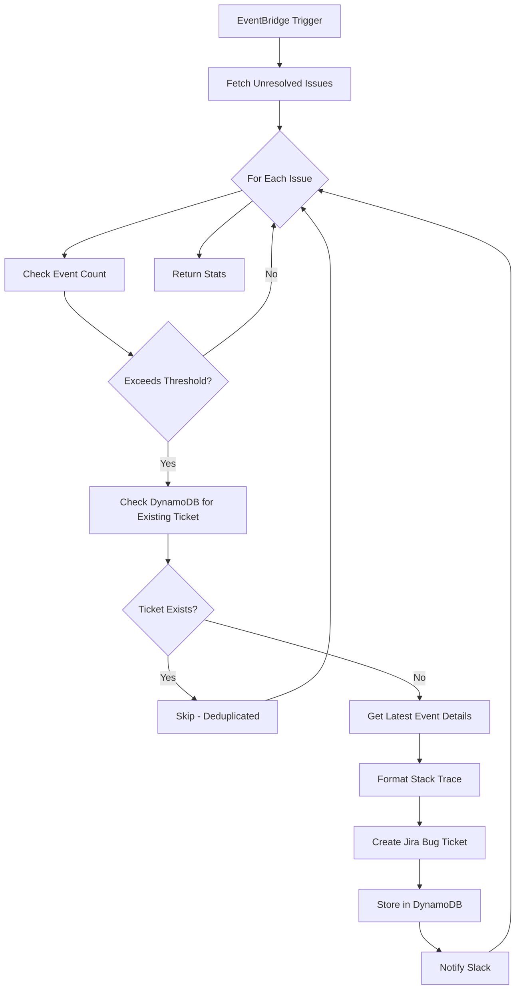

**Threshold Configuration**:

| Error Level | Events (24h) | Action |
|-------------|--------------|--------|
| `fatal` | 1+ | Immediate ticket creation |
| `error` | 10+ | Create ticket |
| `warning` | 50+ | Create ticket |
| `info` | 100+ | Create ticket |

**Jira Ticket Template**:
```markdown
## Sentry Error Report

**Error:** {issue_title}
**Type:** {issue_type}
**Level:** {level}

### Statistics (24h)
- **Event Count:** {count}
- **Affected Users:** {user_count}
- **First Seen:** {first_seen}
- **Last Seen:** {last_seen}

### Stack Trace
```
{formatted_stack_trace}
```

### Environment
- **Platform:** {platform}
- **Release:** {release}
- **Environment:** {environment}

### Sentry Link
{permalink}

---
*Auto-created by AI Sentry Agent*
*Fingerprint: {issue_id}*
```

---

### Slack Agent

**Lambda Handler**: `agents/slack_agent/main.py`

**Trigger**: API Gateway (Slack events)

**Purpose**: Handle slash commands, send notifications.

**Supported Commands**:

| Command | Description | DynamoDB Operation |
|---------|-------------|-------------------|
| `/agent status <id>` | Get task status | GetItem |
| `/agent approve <id>` | Approve plan | UpdateItem |
| `/agent reject <id>` | Reject plan | UpdateItem |
| `/agent retry <id>` | Retry failed task | UpdateItem |
| `/agent list [status]` | List tasks | Scan |
| `/agent help` | Show help | None |

**Approval Flow**:

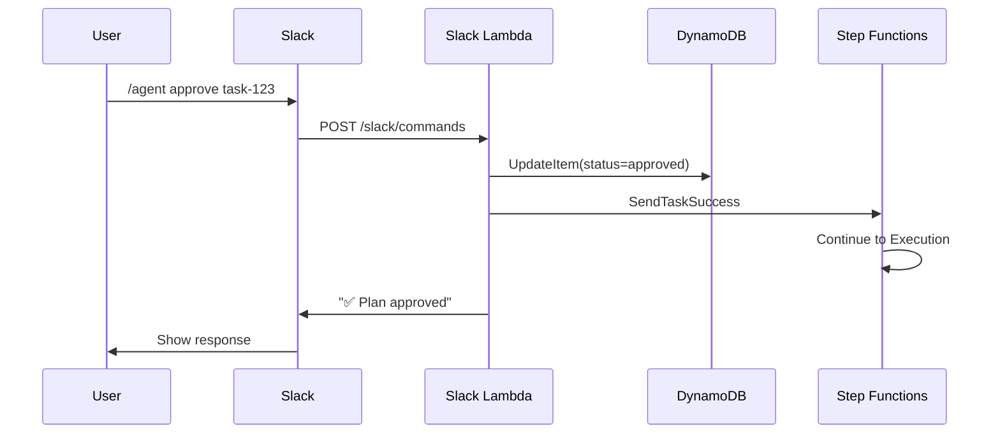

---

## Workflow Orchestration

### Step Functions State Machine

```json
{
  "Comment": "AI Agent Workflow",
  "StartAt": "Discovery",
  "States": {
    "Discovery": {
      "Type": "Task",
      "Resource": "arn:aws:lambda:...:discovery-agent",
      "Next": "Planning",
      "Retry": [{"ErrorEquals": ["States.ALL"], "MaxAttempts": 2}]
    },
    "Planning": {
      "Type": "Task",
      "Resource": "arn:aws:lambda:...:planning-agent",
      "Next": "WaitForApproval"
    },
    "WaitForApproval": {
      "Type": "Task",
      "Resource": "arn:aws:states:::lambda:invoke.waitForTaskToken",
      "Parameters": {
        "FunctionName": "slack-approval-handler",
        "Payload": {
          "taskToken.$": "$$.Task.Token",
          "taskId.$": "$.taskId"
        }
      },
      "Next": "CheckApproval"
    },
    "CheckApproval": {
      "Type": "Choice",
      "Choices": [
        {
          "Variable": "$.approved",
          "BooleanEquals": true,
          "Next": "Execution"
        }
      ],
      "Default": "Rejected"
    },
    "Execution": {
      "Type": "Task",
      "Resource": "arn:aws:lambda:...:execution-agent",
      "Next": "CICDMonitoring",
      "Retry": [{"ErrorEquals": ["States.ALL"], "MaxAttempts": 2}]
    },
    "CICDMonitoring": {
      "Type": "Task",
      "Resource": "arn:aws:lambda:...:cicd-agent",
      "Next": "Complete"
    },
    "Complete": {
      "Type": "Task",
      "Resource": "arn:aws:lambda:...:notify-completion",
      "End": true
    },
    "Rejected": {
      "Type": "Pass",
      "End": true
    }
  }
}
```

### State Machine Diagram

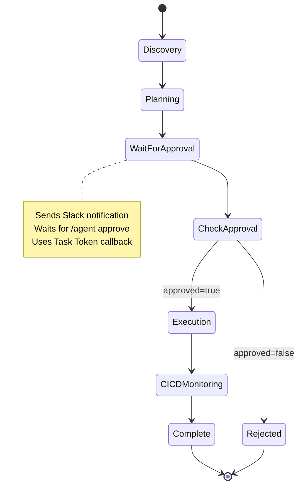

---

## MCP Tools & AgentCore

### Available MCP Tools

#### github-mcp

| Method | Description |
|--------|-------------|
| `search_code(query, org)` | Search code in organization |
| `get_repo(owner, repo)` | Get repository details |
| `get_tree(owner, repo, sha)` | Get repository file tree |
| `get_file_content(owner, repo, path, ref)` | Get file content |
| `create_branch(owner, repo, branch, from_ref)` | Create new branch |
| `create_or_update_file(owner, repo, path, content, message, branch)` | Create/update file |
| `create_pull_request(owner, repo, title, body, head, base)` | Create PR |
| `get_pull_request(owner, repo, number)` | Get PR details |
| `list_workflow_runs(owner, repo, branch)` | List CI runs |
| `get_workflow_run_logs(owner, repo, run_id)` | Get CI logs |

#### jira-mcp

| Method | Description |
|--------|-------------|
| `get_issue(issue_key)` | Get issue details |
| `search_issues(jql, max_results)` | Search with JQL |
| `create_issue(project, issue_type, summary, description, labels)` | Create issue |
| `update_issue(issue_key, fields)` | Update issue |
| `add_comment(issue_key, body)` | Add comment |
| `transition_issue(issue_key, transition_id)` | Change status |

#### sentry-mcp

| Method | Description |
|--------|-------------|
| `list_issues(organization, project, query, stats_period)` | List issues |
| `get_issue(issue_id)` | Get issue details |
| `get_latest_event(issue_id)` | Get most recent event |
| `resolve_issue(issue_id)` | Mark resolved |

#### slack-mcp-adapter (Custom)

| Method | Description |
|--------|-------------|
| `send_message(channel, text, blocks)` | Send message |
| `send_approval_request(channel, message, callback_id)` | Interactive approval |
| `send_notification(channel, type, data)` | Formatted notification |

#### code-interpreter

| Method | Description |
|--------|-------------|
| `execute(language, code, timeout)` | Run code in sandbox |
| `install_packages(packages)` | Install dependencies |
| `create_file(path, content)` | Create file in sandbox |
| `read_file(path)` | Read file from sandbox |

---

## Event Triggers

### Webhook Router

The webhook router (`lambda/webhook-router/handler.py`) receives all external webhooks and routes to step functions.

#### Jira Webhooks

```python
# Trigger: issue_created or issue_updated with "AI" label
if webhook_event == 'jira:issue_created':
    if 'AI' in issue_labels:
        start_step_functions(issue)

elif webhook_event == 'jira:issue_updated':
    if 'AI' added to labels:
        start_step_functions(issue)
```

#### GitHub Webhooks

```python
# Trigger: @agent mention in PR comments
if event_type == 'issue_comment':
    if '@agent' in comment_body:
        handle_agent_command(comment)

# Trigger: AI-created PR updated
if event_type == 'pull_request':
    if action in ['opened', 'synchronize']:
        if 'AI Agent' in pr_body:
            start_ci_monitoring(pr)
```

#### Sentry Webhooks

```python
# Trigger: High severity issues (optional)
if action == 'triggered':
    if issue_level == 'fatal':
        immediate_alert()
```

### EventBridge Schedule

```hcl
# Terraform
resource "aws_cloudwatch_event_rule" "sentry_monitor" {
  name                = "sentry-monitor-hourly"
  schedule_expression = "rate(1 hour)"
}

resource "aws_cloudwatch_event_target" "sentry_lambda" {
  rule      = aws_cloudwatch_event_rule.sentry_monitor.name
  target_id = "sentry-agent"
  arn       = aws_lambda_function.sentry_agent.arn
}
```

---

## Data Flow

### Complete Data Flow Diagram

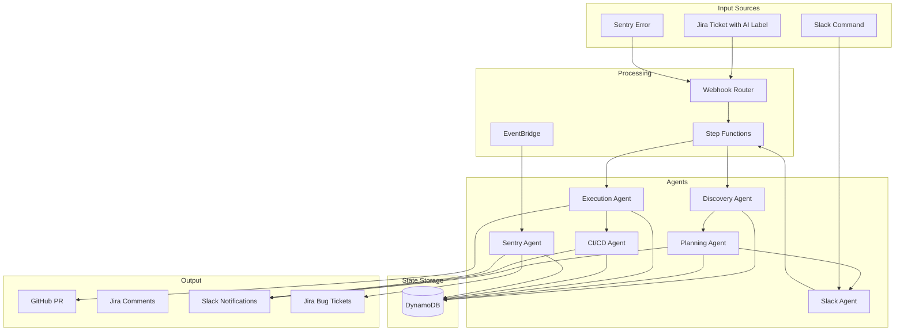

### Task State Transitions

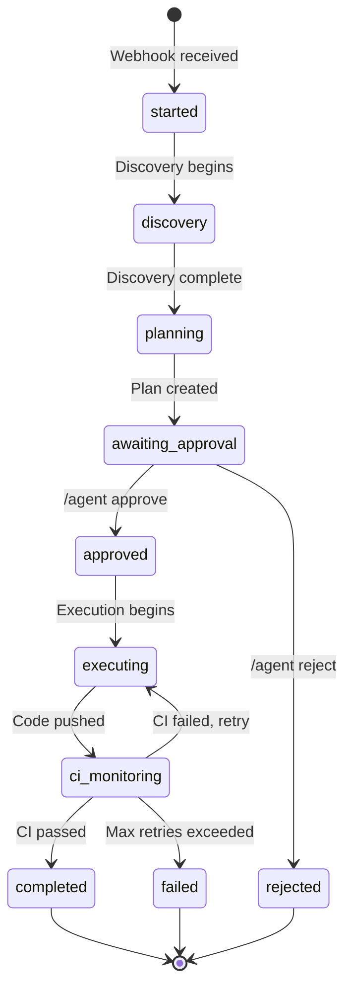

---

## Security & Secrets

### Secrets Manager Structure

```json
{
  "GITHUB_TOKEN": "ghp_...",
  "GITHUB_WEBHOOK_SECRET": "...",
  "JIRA_API_TOKEN": "...",
  "JIRA_EMAIL": "bot@company.com",
  "SLACK_BOT_TOKEN": "xoxb-...",
  "SLACK_SIGNING_SECRET": "...",
  "SENTRY_AUTH_TOKEN": "...",
  "SENTRY_WEBHOOK_SECRET": "..."
}
```

### IAM Roles

Each Lambda has a dedicated IAM role with least-privilege:

```hcl
# Example: Discovery Agent Role
resource "aws_iam_role" "discovery_agent" {
  name = "discovery-agent-role"
  
  inline_policy {
    name = "discovery-agent-policy"
    policy = jsonencode({
      Version = "2012-10-17"
      Statement = [
        {
          Effect = "Allow"
          Action = [
            "secretsmanager:GetSecretValue"
          ]
          Resource = [aws_secretsmanager_secret.agent_secrets.arn]
        },
        {
          Effect = "Allow"
          Action = [
            "dynamodb:PutItem",
            "dynamodb:GetItem",
            "dynamodb:UpdateItem"
          ]
          Resource = [aws_dynamodb_table.tasks.arn]
        },
        {
          Effect = "Allow"
          Action = [
            "bedrock:InvokeModel"
          ]
          Resource = ["*"]
        }
      ]
    })
  }
}
```

### Webhook Signature Verification

```python
def verify_github_webhook(headers: dict, body: str) -> bool:
    signature = headers.get('x-hub-signature-256', '')
    secret = os.environ.get('GITHUB_WEBHOOK_SECRET', '')
    
    expected = 'sha256=' + hmac.new(
        secret.encode(),
        body.encode(),
        hashlib.sha256
    ).hexdigest()
    
    return hmac.compare_digest(signature, expected)
```

---

## Monitoring & Observability

### CloudWatch Metrics

| Metric | Description | Alarm Threshold |
|--------|-------------|-----------------|
| `TasksStarted` | Workflows initiated | N/A |
| `TasksCompleted` | Successful completions | N/A |
| `TasksFailed` | Failed workflows | > 5 per hour |
| `DiscoveryDuration` | Discovery phase time | > 60 seconds |
| `PlanningDuration` | Planning phase time | > 120 seconds |
| `ExecutionDuration` | Execution phase time | > 300 seconds |
| `CIFixAttempts` | Auto-fix attempts | > 10 per hour |
| `EscalationsCount` | Human escalations | > 3 per day |

### Structured Logging

All agents use structured logging with context:

```python
logger.info(
    "task_completed",
    task_id=task_id,
    ticket_id=ticket_id,
    duration_seconds=duration,
    tasks_completed=len(completed),
    tasks_failed=len(failed)
)
```

### X-Ray Tracing

```python
from aws_xray_sdk.core import patch_all
patch_all()

# Traces show:
# - Lambda cold start
# - DynamoDB operations
# - External API calls
# - LLM inference time
```

---

## Deployment

### Terraform Deployment

```bash
cd terraform/

# Initialize
terraform init

# Plan
terraform plan -var-file=production.tfvars

# Apply
terraform apply -var-file=production.tfvars
```

### Required Variables

```hcl
# production.tfvars
aws_region           = "us-east-1"
environment          = "production"
github_org           = "your-org"
jira_base_url        = "https://company.atlassian.net"
jira_project_key     = "PROJ"
slack_channel_agents = "#ai-agents"
sentry_org           = "your-org"
```

```bash
# Build and deploy each agent
for agent in discovery planning execution cicd sentry slack; do
    cd agents/${agent}_agent
    pip install -r requirements.txt -t package/
    cp main.py package/
    cd package && zip -r ../${agent}.zip .
    aws lambda update-function-code \
        --function-name ${agent}-agent \
        --zip-file fileb://../${agent}.zip
    cd ../..
done
```

---

## Local Development

The multiple-agents system can run locally for testing and development before deploying to AWS.

### Prerequisites

```bash
cd multiple-agents-system
pip install -e .
```

### Environment Variables

Create a `.env` file:

```bash
# LLM (Anthropic for local, Bedrock for AWS)
ANTHROPIC_API_KEY=sk-ant-...

# GitHub
GITHUB_TOKEN=ghp_...
GITHUB_ORG=your-org

# Jira
JIRA_BASE_URL=https://company.atlassian.net
JIRA_API_TOKEN=...
JIRA_EMAIL=user@company.com
JIRA_PROJECT_KEY=PROJ

# Slack
SLACK_BOT_TOKEN=xoxb-...
SLACK_CHANNEL_AGENTS=#ai-agents

# Sentry
SENTRY_ORG=your-org
SENTRY_AUTH_TOKEN=...
```

### CLI Commands

```bash
# Run workflow for a Jira ticket
python cli.py run --ticket PROJ-123

# Run workflow from description
python cli.py run --description "Add OAuth support"

# Start webhook server
python cli.py serve --port 8001

# Simulate Slack commands
python cli.py agent status <task-id>
python cli.py agent approve <task-id>

# Run Sentry monitoring
python cli.py monitor-sentry

# Show configuration
python cli.py config
```

### Webhook Server

The local webhook server enables testing with real external services:

```bash
# Terminal 1: Start server
python cli.py serve --port 8001

# Terminal 2: Expose via ngrok
ngrok http 8001
```

Configure webhooks in external services:
- **Jira**: `https://<ngrok-url>/webhooks/jira`
- **GitHub**: `https://<ngrok-url>/webhooks/github`
- **Sentry**: `https://<ngrok-url>/webhooks/sentry`
- **Slack**: `https://<ngrok-url>/webhooks/slack`

### Local vs AWS Comparison

| Aspect | Local Mode | AWS Mode |
|--------|------------|----------|
| **LLM** | Anthropic API | AWS Bedrock |
| **Storage** | In-memory | DynamoDB |
| **Gateway** | LocalGateway | AgentCoreGateway |
| **Orchestration** | LocalAgentOrchestrator | Step Functions |
| **Webhooks** | FastAPI + ngrok | API Gateway |

### Architecture (Local Mode)

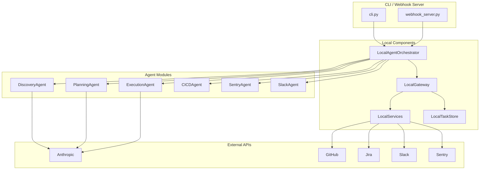

