# Single-Agent System - Architecture & Process Flow

> **Purpose**: Local implementation of the distributed multi-agent system for development, testing, and validation before deploying to AWS. Uses the same AWS Bedrock + AgentCore as the cloud system.

---

## Table of Contents

1. [Overview](#overview)
2. [System Architecture](#system-architecture)
3. [Component Details](#component-details)
4. [Process Flow](#process-flow)
5. [Data Models](#data-models)
6. [Configuration](#configuration)
7. [Integration Points](#integration-points)
8. [GitHub PR Approval Trigger](#github-pr-approval-trigger)
9. [Local vs Distributed Comparison](#local-vs-distributed-comparison)

---

## Overview

### What is the Single-Agent System?

The Single-Agent System is a **local development environment** that replicates the behavior of the distributed multi-agent AWS system. It allows developers to:

- Test the complete agent workflow without deploying to AWS
- Debug and iterate on agent logic quickly
- Validate integrations with GitHub, Jira, Slack, and Sentry
- Understand the full process flow in a single process
- Use the same AWS Bedrock + AgentCore as the cloud version

### Key Characteristics

| Aspect | Description |
|--------|-------------|
| **Execution Model** | Single Python process |
| **LLM Provider** | AWS Bedrock (Claude via langchain-aws) |
| **State Management** | In-memory dictionary |
| **Workflow Engine** | Python orchestrator (simulates Step Functions) |
| **MCP Tools** | AgentCore Gateway (same as cloud) |

---

## System Architecture

### High-Level Architecture Diagram


### Directory Structure

```
single-agent-system/
├── pyproject.toml              # Dependencies and build config
├── .env.example                # Environment template
├── cli.py                      # Command-line interface
│
├── config/
│   ├── __init__.py
│   └── settings.py             # Centralized configuration
│
├── mcp/
│   ├── __init__.py
│   └── gateway.py              # MCP-compatible gateway
│       ├── MCPGateway          # Main gateway class
│       ├── MCPToolProxy        # Tool invocation proxy
│       ├── CodeInterpreter     # Local code execution
│       └── LocalTaskStore      # In-memory state storage
│
├── agents/
│   ├── __init__.py
│   ├── orchestrator.py         # Workflow orchestrator
│   ├── discovery_agent.py      # Repository discovery
│   ├── planning_agent.py       # Implementation planning
│   ├── execution_agent.py      # Code generation
│   ├── cicd_agent.py           # CI/CD monitoring
│   ├── sentry_agent.py         # Error monitoring
│   └── slack_agent.py          # Slack interactions
│
├── services/
│   ├── __init__.py
│   ├── github_service.py       # GitHub API wrapper
│   ├── jira_service.py         # Jira API wrapper
│   ├── slack_service.py        # Slack API wrapper
│   └── sentry_service.py       # Sentry API wrapper
│
├── prompts/
│   ├── discovery/system.md     # Discovery agent prompt
│   ├── planning/system.md      # Planning agent prompt
│   ├── execution/system.md     # Execution agent prompt
│   ├── cicd/system.md          # CI/CD agent prompt
│   ├── sentry/system.md        # Sentry agent prompt
│   └── slack/system.md         # Slack agent prompt
│
└── examples/
    └── sample_ticket.json      # Sample input data
```

---

## Component Details

### 1. CLI Interface (`cli.py`)

The command-line interface provides entry points for all system operations.

#### Available Commands

| Command | Description | Example |
|---------|-------------|---------|
| `run` | Execute full workflow | `cli.py run --ticket PROJ-123` |
| `agent` | Simulate Slack commands | `cli.py agent status <id>` |
| `config` | Show configuration | `cli.py config` |
| `monitor-sentry` | Run Sentry monitor | `cli.py monitor-sentry` |
| `list-tickets` | List Jira tickets | `cli.py list-tickets` |
| `list-errors` | List Sentry errors | `cli.py list-errors` |

#### Run Command Options

```bash
python3 cli.py run \
  --ticket PROJ-123 \      # Load from Jira
  --description "..." \    # Or use text description
  --file ticket.json \     # Or load from JSON
  --dry-run \              # No external changes
  --wait-approval          # Pause for approval
```

---

### 2. MCP Gateway (`mcp/gateway.py`)

The MCP Gateway provides a unified interface for accessing tools and services, mirroring the AWS AgentCore Gateway.

#### MCPGateway Class

```python
class MCPGateway:
    """Central gateway for tool and service access."""
    
    def __init__(self):
        # Initialize tool proxies
        self._tools["github-mcp"] = MCPToolProxy("github-mcp", GitHubService())
        self._tools["jira-mcp"] = MCPToolProxy("jira-mcp", JiraService())
        self._tools["slack"] = MCPToolProxy("slack", SlackService())
        self._tools["sentry-mcp"] = MCPToolProxy("sentry-mcp", SentryService())
        
        # Initialize services
        self._services["code-interpreter"] = CodeInterpreterService()
        self._services["task-store"] = LocalTaskStore()
    
    def get_tool(self, tool_name: str) -> MCPToolProxy:
        """Get an MCP tool proxy."""
        return self._tools[tool_name]
    
    def get_service(self, service_name: str) -> Any:
        """Get a service instance."""
        return self._services[service_name]
```

#### Tool Proxy Pattern

```python
class MCPToolProxy:
    """Proxy for MCP-style tool invocation."""
    
    def __init__(self, tool_name: str, service: Any):
        self.tool_name = tool_name
        self.service = service
    
    def __getattr__(self, method_name: str):
        """Delegate method calls to underlying service."""
        return getattr(self.service, method_name)
```

#### LocalTaskStore

In-memory replacement for DynamoDB:

```python
class LocalTaskStore:
    """In-memory task storage."""
    
    def put_item(self, item: Dict) -> None
    def get_item(self, pk: str, sk: str) -> Optional[Dict]
    def update_item(self, pk: str, sk: str, updates: Dict) -> None
    def scan(self, filter_status: Optional[str]) -> List[Dict]
```

---

### 3. Agent Orchestrator (`agents/orchestrator.py`)

The orchestrator manages the complete workflow, simulating AWS Step Functions.

#### Workflow Phases


#### Orchestrator Class

```python
class AgentOrchestrator:
    def __init__(self):
        self.gateway = get_gateway()
        
        # Initialize all agents
        self.discovery = DiscoveryAgent(self.gateway)
        self.planning = PlanningAgent(self.gateway)
        self.execution = ExecutionAgent(self.gateway)
        self.cicd = CICDAgent(self.gateway)
        self.sentry = SentryAgent(self.gateway)
        self.slack = SlackAgent(self.gateway)
    
    def run_full_workflow(self, ticket: Dict, auto_approve: bool = True) -> Dict:
        """Execute complete workflow."""
        # Phase 1: Discovery
        discovery_result = self.discovery.run(ticket)
        
        # Phase 2: Planning
        planning_result = self.planning.run({
            "ticketId": ticket["id"],
            "discoveryResults": discovery_result
        })
        
        # Phase 3: Approval (simulated or wait)
        if not auto_approve:
            return {"awaitingApproval": True}
        
        # Phase 4: Execution
        execution_result = self.execution.run({
            "plan": planning_result["plan"]
        })
        
        # Phase 5: CI/CD Monitoring
        cicd_result = self.cicd.run({
            "repo": ...,
            "prNumber": ...
        })
        
        return {"success": True, "phases": {...}}
```

---

### 4. Individual Agents

Each agent is a self-contained class with:
- LLM access (Anthropic)
- MCP tool access via gateway
- Dedicated system prompt
- Specific workflow logic

#### Agent Base Pattern

```python
class Agent:
    def __init__(self, mcp_gateway):
        self.anthropic = Anthropic(api_key=settings.anthropic.api_key)
        self.model = settings.anthropic.<agent>_model
        self._load_prompts()
    
    def _load_prompts(self):
        prompts_dir = Path(__file__).parent.parent / "prompts" / "<agent>"
        self.system_prompt = (prompts_dir / "system.md").read_text()
    
    def _call_llm(self, prompt: str, max_tokens: int = 4096) -> str:
        response = self.anthropic.messages.create(
            model=self.model,
            max_tokens=max_tokens,
            system=self.system_prompt,
            messages=[{"role": "user", "content": prompt}]
        )
        return response.content[0].text
    
    def run(self, request: Dict) -> Dict:
        """Agent-specific workflow."""
        ...
```

#### Discovery Agent

**Purpose**: Find relevant repositories and files for a ticket.

**Process**:
1. Extract keywords from ticket (LLM)
2. Search GitHub organization
3. Analyze repository trees
4. Rank by relevance
5. Identify cross-repo dependencies

**Output**:
```python
{
    "relevantRepos": [
        {"name": "auth-service", "relevance": 0.9, "files": [...]}
    ],
    "crossRepoDependencies": [...],
    "estimatedComplexity": "Medium",
    "recommendedApproach": "...",
    "keywords": ["OAuth", "authentication", ...]
}
```

#### Planning Agent

**Purpose**: Create TDD implementation plan.

**Process**:
1. Fetch full ticket details
2. Define scope (in/out)
3. Design architecture
4. Create test plan (TDD - tests first!)
5. Break down tasks
6. Generate PLAN.md
7. Create GitHub PRs

**Output**:
```python
{
    "plan": {
        "scope": {"inScope": [...], "outOfScope": [...]},
        "architecture": {"components": [...], "dataFlow": "..."},
        "testStrategy": {"unitTests": [...], "integrationTests": [...]},
        "implementation": {"tasks": [...]}
    },
    "prsCreated": [{"repo": "...", "prNumber": 42, "prUrl": "..."}],
    "totalEstimatedHours": 24
}
```

#### Execution Agent

**Purpose**: Implement code according to plan.

**Process**:
1. Process tasks in dependency order
2. For each task:
   - Get existing code (if modifying)
   - Generate new code (LLM)
   - Save to output directory
   - Run tests (if applicable)
3. Retry on failure (max 3 attempts)

**Output**:
```python
{
    "completedTasks": [1, 2, 3],
    "failedTasks": [],
    "taskResults": [
        {"taskId": 1, "status": "success", "filesModified": [...]}
    ]
}
```

#### CI/CD Agent

**Purpose**: Monitor GitHub Actions, attempt auto-fixes.

**Auto-Fixable Issues**:
| Type | Detection | Fix Command |
|------|-----------|-------------|
| ESLint | `error ... eslint` | `npx eslint --fix .` |
| Prettier | `error ... prettier` | `npx prettier --write .` |
| Ruff | `ruff check` | `ruff check --fix .` |
| Black | `would reformat` | `black .` |

**Non-Fixable (Escalate)**:
- Test assertion failures
- Compilation errors
- Security vulnerabilities

#### Sentry Agent

**Purpose**: Monitor errors, create Jira tickets.

**Thresholds**:
| Level | Events (24h) | Action |
|-------|--------------|--------|
| Fatal | 1+ | Immediate ticket |
| Error | 10+ | Create ticket |
| Warning | 50+ | Create ticket |

**Deduplication**: Uses LocalTaskStore to prevent duplicate tickets.

#### Slack Agent

**Purpose**: Handle commands, send notifications.

**Commands**:
- `status <id>` - Get task status
- `approve <id>` - Approve plan
- `reject <id>` - Reject plan
- `retry <id>` - Retry failed task
- `list [status]` - List tasks

---

## Process Flow

### Complete Workflow Flow


---

## Data Models

### Ticket Input

```python
{
    "id": "PROJ-123",           # Ticket ID
    "key": "PROJ-123",          # Jira key
    "summary": "Add OAuth",     # Title
    "description": "...",       # Full description
    "labels": ["feature"],      # Labels
    "priority": "High"          # Priority
}
```

### Task State

```python
{
    "pk": "TASK#local-PROJ-123-1705500000",
    "sk": "METADATA",
    "task_id": "local-PROJ-123-1705500000",
    "ticket_id": "PROJ-123",
    "status": "executing",      # started|discovery|planning|executing|complete|failed
    "current_agent": "Execution",
    "progress": 50,
    "created_at": "2026-01-17T15:00:00Z",
    "last_update": "2026-01-17T15:30:00Z"
}
```

### Workflow Result

```python
{
    "taskId": "local-PROJ-123-1705500000",
    "ticketId": "PROJ-123",
    "success": True,
    "phases": {
        "discovery": {...},
        "planning": {...},
        "execution": {...},
        "cicd": {...}
    },
    "error": None
}
```

---

## Configuration

### Environment Variables

```bash
# LLM Configuration
ANTHROPIC_API_KEY=sk-ant-...
DISCOVERY_MODEL=claude-sonnet-4-20250514
PLANNING_MODEL=claude-opus-4-20250514
EXECUTION_MODEL=claude-opus-4-20250514

# GitHub
GITHUB_TOKEN=ghp_...
GITHUB_ORG=your-org
GITHUB_DEFAULT_REPO=main-repo

# Jira
JIRA_BASE_URL=https://company.atlassian.net
JIRA_API_TOKEN=...
JIRA_EMAIL=user@company.com
JIRA_PROJECT_KEY=PROJ

# Slack
SLACK_BOT_TOKEN=xoxb-...
SLACK_CHANNEL_AGENTS=#ai-agents
SLACK_CHANNEL_ERRORS=#ai-errors

# Sentry
SENTRY_ORG=your-org
SENTRY_AUTH_TOKEN=...

# Execution
OUTPUT_DIR=./output
DRY_RUN=false
LOG_LEVEL=INFO
```

### Settings Class

```python
@dataclass
class Settings:
    anthropic: AnthropicConfig
    github: GitHubConfig
    jira: JiraConfig
    slack: SlackConfig
    sentry: SentryConfig
    execution: ExecutionConfig
    conventions: ConventionsConfig
```

---

## Integration Points

### GitHub Integration

| Operation | Method | MCP Tool |
|-----------|--------|----------|
| Search code | `search_code(query)` | github-mcp |
| Get repo tree | `get_repo_tree(repo)` | github-mcp |
| Get file | `get_file_content(repo, path)` | github-mcp |
| Create branch | `create_branch(repo, name)` | github-mcp |
| Create/update file | `create_or_update_file(...)` | github-mcp |
| Create PR | `create_pull_request(...)` | github-mcp |

### Jira Integration

| Operation | Method | MCP Tool |
|-----------|--------|----------|
| Get issue | `get_issue(key)` | jira-mcp |
| Search issues | `search_issues(jql)` | jira-mcp |
| Add comment | `add_comment(key, text)` | jira-mcp |
| Create issue | `create_issue(...)` | jira-mcp |
| Transition | `transition_issue(key, to)` | jira-mcp |

### Slack Integration

| Operation | Method | MCP Tool |
|-----------|--------|----------|
| Send message | `send_message(text, channel)` | slack |
| Error notification | `send_error_notification(...)` | slack |
| Agent update | `send_agent_update(...)` | slack |
| Approval request | `send_approval_request(...)` | slack |

### Sentry Integration

| Operation | Method | MCP Tool |
|-----------|--------|----------|
| Get issues | `get_issues(query, limit)` | sentry-mcp |
| Get events | `get_issue_events(id)` | sentry-mcp |
| Check escalation | `should_escalate(issue)` | sentry-mcp |
| Resolve issue | `resolve_issue(id)` | sentry-mcp |

---

## Local vs Distributed Comparison

| Aspect | Single-Agent (Local) | Multiple-Agents (AWS) |
|--------|---------------------|----------------------|
| **Execution** | Single Python process | Lambda functions |
| **Orchestration** | `AgentOrchestrator` class | Step Functions |
| **State Storage** | In-memory `LocalTaskStore` | DynamoDB |
| **Tool Access** | `MCPGateway` | AWS AgentCore Gateway |
| **Triggers** | CLI commands | API Gateway webhooks |
| **Scheduling** | Manual CLI | EventBridge |
| **Approval Flow** | `--wait-approval` flag | Slack interactive |
| **Scaling** | None (local) | Lambda auto-scaling |
| **Cost** | API calls only | AWS service costs |

### Migration Path

To deploy locally-tested agents to AWS:

1. **Agent Code**: Copy agent classes to Lambda handlers
2. **Gateway**: Replace `MCPGateway` with `AgentCoreGateway`
3. **State**: Replace `LocalTaskStore` with DynamoDB
4. **Config**: Move `.env` to Secrets Manager
5. **Workflow**: Deploy Step Functions state machine
6. **Triggers**: Configure API Gateway + EventBridge

---

## Webhook Server

The single-agent system includes a local webhook server for testing external integrations before deploying to AWS.

### Starting the Server

```bash
# Basic usage
python cli.py serve

# Custom port/host
python cli.py serve --port 9000 --host 127.0.0.1
```

### Available Endpoints

| Endpoint | Method | Description |
|----------|--------|-------------|
| `/webhooks/jira` | POST | Handles Jira issue events |
| `/webhooks/github` | POST | Handles GitHub workflow/PR events |
| `/webhooks/sentry` | POST | Handles Sentry error alerts |
| `/webhooks/slack` | POST | Handles Slack slash commands |
| `/health` | GET | Health check |
| `/tasks` | GET | List current tasks (debug) |

### Exposing to External Services

Use ngrok to expose the local server:

```bash
# Terminal 1: Start webhook server
python cli.py serve --port 8000

# Terminal 2: Expose via ngrok
ngrok http 8000
```

Then configure webhooks in external services:
- **Jira**: `https://<ngrok-url>/webhooks/jira`
- **GitHub**: `https://<ngrok-url>/webhooks/github`
- **Sentry**: `https://<ngrok-url>/webhooks/sentry`
- **Slack**: `https://<ngrok-url>/webhooks/slack`

### Testing with curl

```bash
# Test Jira webhook
curl -X POST http://localhost:8000/webhooks/jira \
  -H "Content-Type: application/json" \
  -d '{
    "webhookEvent": "jira:issue_updated",
    "issue": {
      "key": "PROJ-123",
      "fields": {
        "summary": "Test ticket",
        "description": "Test description",
        "labels": [{"name": "AI"}]
      }
    },
    "changelog": {
      "items": [{"field": "labels", "toString": "AI"}]
    }
  }'

# Test health endpoint
curl http://localhost:8000/health
```

### Environment Variables

| Variable | Description | Default |
|----------|-------------|---------|
| `WEBHOOK_HOST` | Server bind host | `0.0.0.0` |
| `WEBHOOK_PORT` | Server bind port | `8000` |
| `JIRA_WEBHOOK_SECRET` | Jira signature verification | (none) |
| `GITHUB_WEBHOOK_SECRET` | GitHub signature verification | (none) |
| `SENTRY_WEBHOOK_SECRET` | Sentry signature verification | (none) |
| `SLACK_SIGNING_SECRET` | Slack signature verification | (none) |

### Architecture


---

## GitHub PR Approval Trigger

The webhook server handles GitHub PR comments to trigger execution after plan approval.

### Trigger Commands

Comment on a planning PR with:

| Command | Action |
|---------|--------|
| `@agent approve` | Approve plan and start execution |
| `@agent execute` | Same as approve |
| `@agent status` | Get current task status |
| `@agent reject` | Cancel execution |

### Flow

```mermaid
sequenceDiagram
    participant Dev as Developer
    participant GH as GitHub PR
    participant WS as Webhook Server
    participant Agent as Execution Agent
    
    Dev->>GH: Comment "@agent approve"
    GH->>WS: POST /webhooks/github
    WS->>WS: Parse command
    WS->>GH: Comment "🚀 Execution Started"
    WS->>Agent: run_execution_from_pr()
    Agent->>GH: Read PLAN.md from PR branch
    Agent->>Agent: Execute tasks
    Agent->>GH: Commit changes
    Agent->>GH: Comment "✅ Execution Complete"
```



### Configuration

Ensure GitHub webhook is configured for PR comments:
- Events: `issue_comment`
- URL: `https://<your-domain>/webhooks/github`
- Secret: Set in `GITHUB_WEBHOOK_SECRET`

